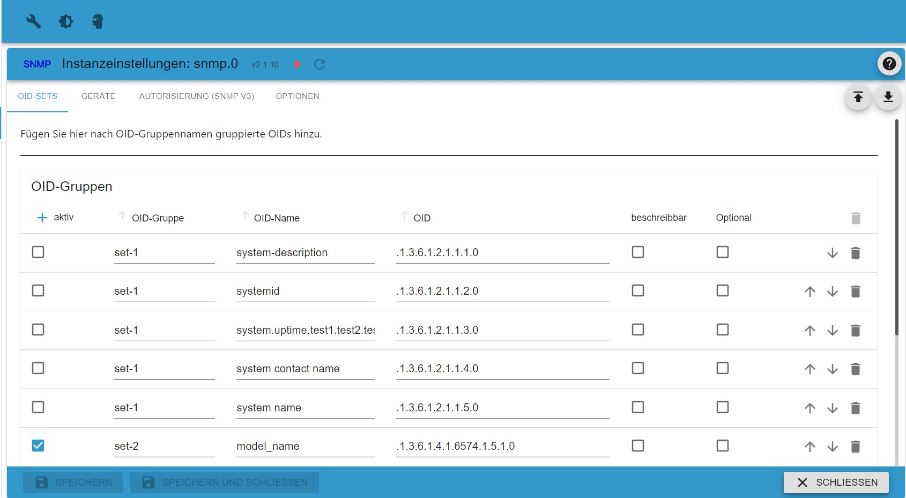
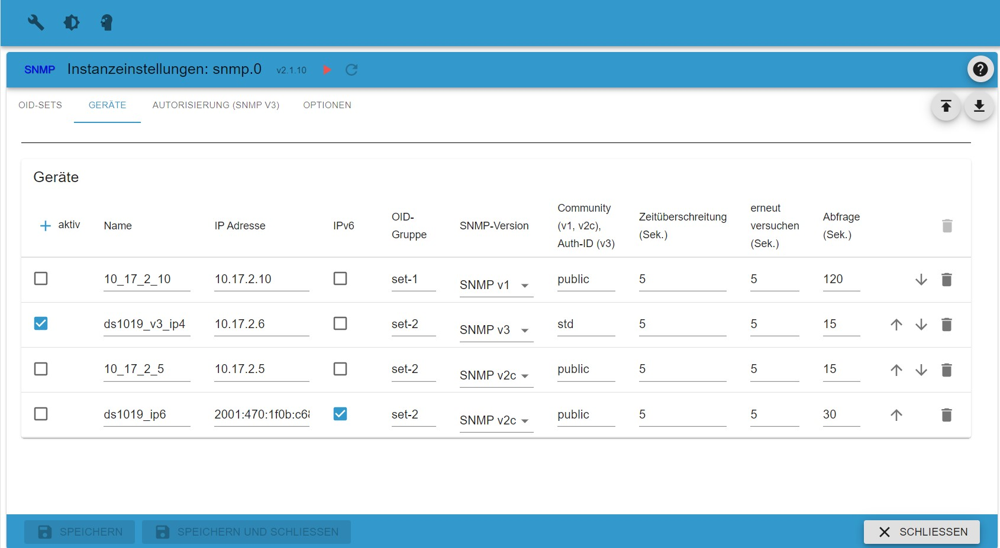
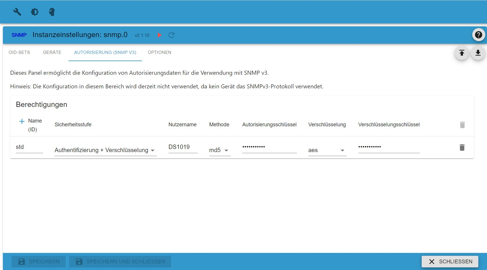
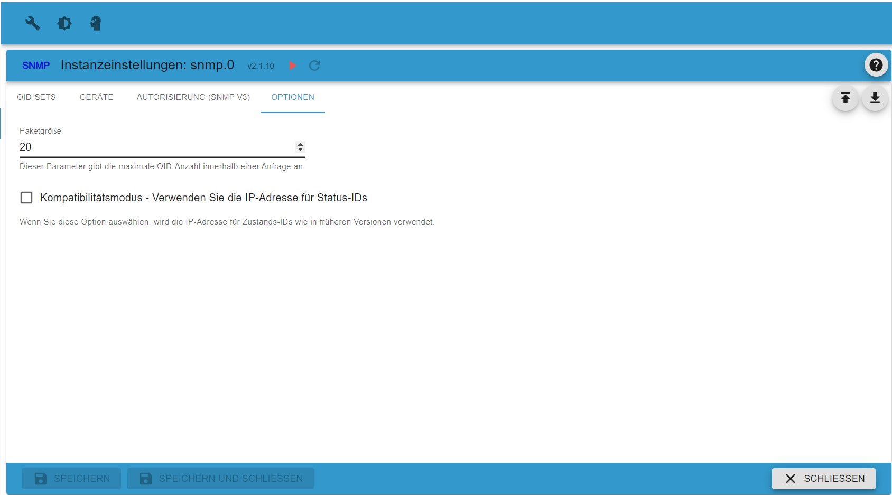

# Informationen zum SNMP-Adapter

## Allgemeine Information

Das Simple Network Management Protocol (SNMP) ist ein Internet-Standardprotokoll zum Sammeln und Organisieren von Informationen über
verwaltete Geräte in IP-Netzwerken und zum Ändern dieser Informationen, um das Geräteverhalten zu ändern. Geräte, die normalerweise 
SNMP unterstützen umfasst Kabelmodems, Router, Switches, Server, Workstations, Drucker und mehr.

SNMP wird in der Netzwerkverwaltung häufig zur Netzwerküberwachung verwendet. SNMP legt Verwaltungsdaten in Form von Variablen offen
die in einer Management Information Base (MIB) organisiert sind und den Systemstatus und die Konfiguration beschreiben.
Diese Variablen können dann von Anwendungen aus der Ferne abgefragt (und unter Umständen manipuliert) werden.

Drei bedeutende Versionen von SNMP wurden entwickelt und bereitgestellt. SNMPv1 ist die ursprüngliche Version des Protokolls.
Neuere Versionen, SNMPv2c und SNMPv3, bieten Verbesserungen in Leistung, Flexibilität und Sicherheit.
(Text entnommen aus Wikipedia, der freien Enzyklopädie)

Der SNMP-Adapter verwendet die sogenannten OID’s (Object Identifier) ​​um diese Werte aus dem konfigurierten Gerät auszulesen.

## Konfiguration

Der Adapter fragt bestimmte OIDs (Objektkennungen) ab, die in OID-Gruppen gruppiert sind, die wiederum Geräten zugeordnet sind. Die
Konfigurationsdaten werden auf mehreren Registerkarten eingegeben:

### TAB OID-Gruppen
Hier geben Sie alle OIDs an, die vom Adapter abgefragt werden sollen, eine OID pro Zeile.

| Parameter | Typ | Beschreibung | Kommentar |
|-----------|-------------|----------------------|------------------------------------|
| aktiv | boolesch | wenn auf true gesetzt, wird diese OID verwendet | kann verwendet werden, um eine einzelne OID zu deaktivieren |
| OID-Gruppe | Text | Name der OID-Gruppe | wird verwendet, um die Gruppe dem Gerät zuzuweisen |
| OID-Name | Text | Name, der der OID zugeordnet ist | wird verwendet, um den Datenpunkt zu benennen |
| OID | Text | oid-Zeichenfolge (1.2.3.4.) | oid-Zeichenfolge, wie vom Gerätehersteller angegeben |
| beschreibbar | boolesch | sollte auf true gesetzt werden, wenn OID beschreibbar ist | reserviert für zukünftige Verwendung |
| optional | boolesch | sollte auf true gesetzt werden, wenn OID optional ist | wenn auf true gesetzt, wird kein Fehler ausgelöst wenn oid unbekannt ist (Funktionalität nicht verfügbar mit snmp V1) |

Sie können einfach jede OID aktivieren/deaktivieren, indem Sie das aktive Flag setzen. Beachten Sie, dass die ID des ioBroker-Zustands zum Speichern der gelesenen Daten
 normalerweise zusammengesetzt wird aus dem Gerätenamen (siehe Registerkarte Geräte) und dem hier angegebenen OID-Namen. Sie können Punkte innerhalb des OID-Namens verwenden
um eine Ordnerstruktur aufzubauen.

Wenn einige OIDs nicht immer verfügbar sind, sollten Sie das Flag optional setzen, um unnötige Fehler zu vermeiden. Bitte beachten Sie, dass dies
die Verwendung der Protokollversionen snmp v2c oder snpm v3 erfordert.
 
### TAB-Geräte
Hier legen Sie fest, welche Geräte abgefragt werden sollen.

| Parameter | Typ | Beschreibung | Kommentar |
|----------|-------------|------ ----------------|-------------------------------- ----|
| aktiv | boolesch | wenn auf true gesetzt, wird das Gerät verwendet | kann verwendet werden, um ein einzelnes Gerät zu deaktivieren |[2001:abcd::30ff]
| Name | Text | Name des Geräts | wird verwendet, um Namen von Datenpunkten zu erstellen |
| IP-Adresse | Text | IP-Adresse (IPv4 oder IPv6) oder Domänenname mit optionaler Portnummer | IPv4 1.2.3.4 oder 1.2.3.4:161, IPv6 2001:abcd::30ff, IPv6 [2001:abcd::30ff] oder [2001:abcd::30ff]:161, Domäne myhost.domain.org oder myhost.domain .org:161 |
| IPv6 | boolesch | wenn gesetzt soll IPv6 verwendet werden | |
| OID-Gruppe | Text | auf der Registerkarte IOD-Gruppen angegebene OID-Gruppe | Eine OID-Gruppe kann mehr als einem Gerät zugeordnet werden | |
| SNMP-Version | wählen Sie | zu verwendende SNMP-Version | |
| Community (v1, v2c) oder Auth-ID (v3) | Text | Community für SNMP v1 oder V2c, Autorisierungsgruppe für SNMP v3 | |
| Zeitüberschreitung (Sek.) | Nummer | Verarbeitungszeitüberschreitung in Sekunden | |
| Wiederholung (Sek.) | Nummer | Wiederholungsintervall in Sekunden | |
| Abfrage (Sek.) | Nummer | Abfrageintervall in Sekunden | |

### TAB-Autorisierung
Diese Registerkarte enthält SNMP V3-Autorisierungsinformationen.

| Parameter | Typ | Beschreibung | Kommentar |
|-------------------|-------------|--------------- --------------------|------------------------------------- --------|
| Name (ID) | Text | ID der Berechtigungsdaten | muss mit Auth-Id bei Tab-Geräten übereinstimmen |
| Sicherheitsstufe | Auswahl | gewünschte Sicherheitsmethode | siehe Beschreibung |
| Benutzername | Text | Benutzername zur Authentifizierung | |
| Methode | Auswahl | Passwort-Hashing-Methode | Unterstützte Methoden sind md5 oder sha |
| Autorisierungsschlüssel | Text | Passwort zur Authentifizierung | |
| Verschlüsselung | Auswahl | Verschlüsselungsverfahren | |
| Verschlüsselungsschlüssel | Text | Verschlüsselungsschlüssel | |

Beachten Sie, dass Name(id) eindeutig sein muss.

Bei Auswahl des snmp V3-Protokolls ist eine erweiterte Authentifizierung erforderlich. In der Liste der Geräte ab Tab Geräte 
geben Sie in der Spalte Auth-Id den Namen eines Authentifizierungsblocks.

Auf dieser Registerkarte müssen Sie die gewünschte Sicherheitsstufe wie folgt auswählen:
* Minimum - nur ein Benutzername ist erforderlich
* Authentifizierung - Benutzername und Passwort sind erforderlich
* Authentifizierung und Verschlüsselung - Benutzername, Passwort und Verschlüsselungsschlüssel sind erforderlich.

Bitte beachten Sie, dass die angegebene Sicherheitsstufe vom Zielgerät unterstützt werden muss und Benutzername, Passwort und Verschlüsselungsschlüssel übereinstimmen müssen
die am Zielgerät eingegebenen Daten. Sie können denselben Autorisierungsblock für mehrere Geräte verwenden, solange sie dieselben Daten verwenden.

### TAB-Optionen
Hier legen Sie einige allgemeine Optionen fest

| Parameter | Typ | Beschreibung | Kommentar |
|----------|-------------|------ ----------------|-------------------------------- ----|
| Paketgröße | Ganzzahl | maximale Anzahl von OIDs, die innerhalb einer einzigen Anfrage gesendet werden | reduzieren Sie diesen Wert bei TOOBIG-Fehlern |
| Kompatibilitätsmodus | boolesch | wenn diese Option aktiviert ist, basieren die Datenpunktnamen auf der IP-Adresse | HINWEIS: veraltet - nicht mehr verwenden. Dieses Flag funktioniert nicht mit IPv6-Adressen. Kann in zukünftigen Versionen entfernt werden. |

Die Option packetsize kann verwendet werden, um die Anzahl der abgefragten OIDs innerhalb einer Anfrage zu reduzieren. Je nach Zielgerät ist die Anzahl der
IODs, die mit einer Anfrage abgefragt werden kann möglicherweise begrenzt. In einem solchen Fall antwortet das Gerät möglicherweise mit Fehler TOOBIG. Versuchen Sie es in einem solchen Fall
den Wert für Option packetsize zu reduzieren.

## OID-Beispiele

Die Suche nach Hersteller und MIB ist in den meisten Fällen erfolgreich. Zusätzlich können Sie eine mib-Browser-Software verwenden
um ihr Zielgerät abzufragen, z. B. https://www.ireasoning.com/mibbrowser.shtml

### Drucker

Für die meisten Drucker gibt es einen Standard. (DRUCKER-MIB)
http://www.oidview.com/mibs/0/Printer-MIB.html

Für den Samsung CLP320 Farblaser z.B. die folgenden OIDs sind gültig.

Anzahl gedruckter Seiten: 1.3.6.1.2.1.43.10.2.1.4.1.1

Schwarzer Toner: 1.3.6.1.2.1.43.11.1.1.9.1.1

Toner Cyan: 1.3.6.1.2.1.43.11.1.1.9.1.2

Toner Magenta: 1.3.6.1.2.1.43.11.1.1.9.1.3

Toner gelb: 1.3.6.1.2.1.43.11.1.1.9.1.4

Life_drum-Einheit: 1.3.6.1.2.1.43.11.1.1.9.1.7

### NAS-Systeme - Synology

Synology: Standardmäßig ist SNMP auf Synology Diskstations deaktiviert und muss in der WebUI aktiviert werden. Wichtig ist, dass der Port 161 standardmäßig erhalten bleibt und die Community richtig eingestellt ist. Meistens ist es öffentlich.

https://global.download.synology.com/download/Document/MIBGuide/Synology_DiskStation_MIB_Guide.pdf