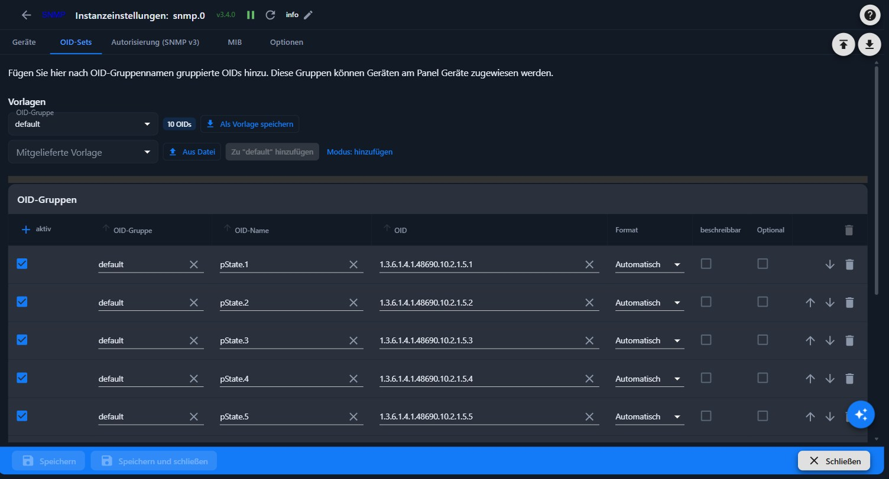
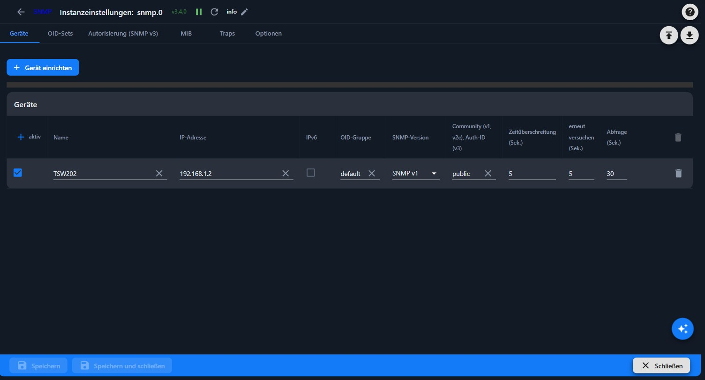
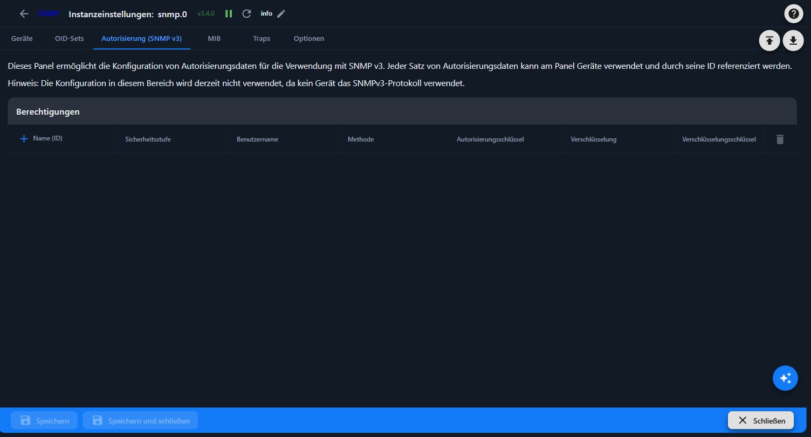
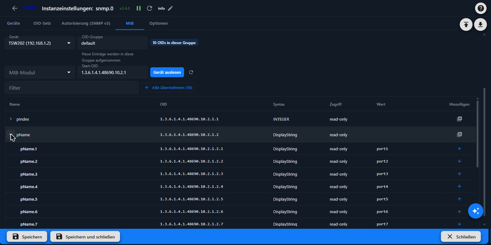
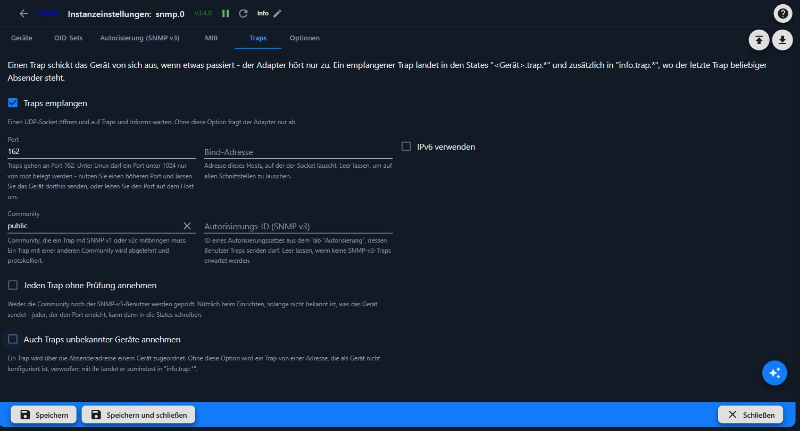
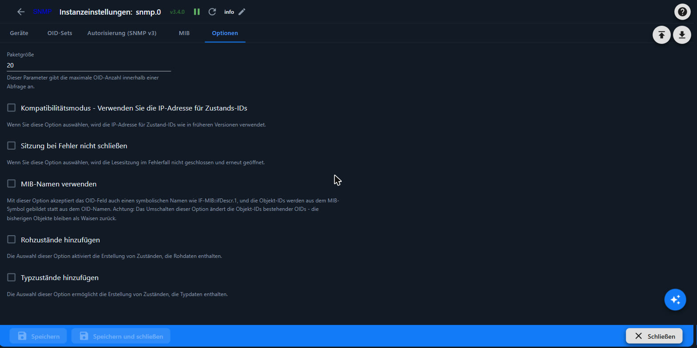

# Informationen zum SNMP-Adapter

## Allgemeine Information
Das `Simple Network Management Protocol` (SNMP) ist ein Internet-Standardprotokoll zum Sammeln und Organisieren von Informationen über
verwaltete Geräte in IP-Netzwerken und zum Ändern dieser Informationen, um das Geräteverhalten zu ändern. Das Gerät, das normalerweise 
SNMP unterstützt, umfasst Kabelmodems, Router, Switches, Server, Workstations, Drucker und mehr.

SNMP wird in der Netzwerkverwaltung häufig zur Netzwerküberwachung verwendet. SNMP legt Verwaltungsdaten in Form von Variablen offen,
die in einer `Management Information Base` (MIB) organisiert sind und den Systemstatus und die Konfiguration beschreiben.
Diese Variablen können dann von Anwendungen aus der Ferne abgefragt (und unter Umständen manipuliert) werden.

Drei bedeutende Versionen von SNMP wurden entwickelt und bereitgestellt. SNMPv1 ist die ursprüngliche Version des Protokolls.
Neuere Versionen, SNMPv2c und SNMPv3, bieten Verbesserungen in Leistung, Flexibilität und Sicherheit.
(Text entnommen aus Wikipedia, der freien Enzyklopädie)

Der SNMP-Adapter verwendet die sogenannten OID’s (Object Identifier), um diese Werte aus dem konfigurierten Gerät auszulesen.

## Konfiguration
Der Adapter fragt bestimmte OIDs (Objektkennungen) ab, die in OID-Gruppen gruppiert sind, die wiederum Geräten zugeordnet sind. Die
Konfigurationsdaten werden auf mehreren Registerkarten eingegeben, und zwar in der Reihenfolge, in der sie erscheinen: zuerst die Geräte,
dann die OIDs, die sie lesen sollen. Ein Gerät, dessen OID-Gruppe es noch nicht gibt, lässt sich speichern - der Adapter warnt und überspringt
dieses Gerät, bis seine OIDs festgelegt sind.

### TAB OID-Gruppen
Hier geben Sie alle OIDs an, die vom Adapter abgefragt werden sollen, eine OID pro Zeile.

<p align=center></p>

| Parameter    | Typ       | Beschreibung                                              | Kommentar                                                                                                             |
|--------------|-----------|-----------------------------------------------------------|-----------------------------------------------------------------------------------------------------------------------|
| aktiv        | boolesch  | wenn auf true gesetzt, wird diese OID verwendet           | kann verwendet werden, um eine einzelne OID zu deaktivieren                                                           |
| OID-Gruppe   | Text      | Name der OID-Gruppe                                       | wird verwendet, um die Gruppe dem Gerät zuzuweisen                                                                    |
| OID-Name     | Text      | Name, der der OID zugeordnet ist                          | wird verwendet, um den Datenpunkt zu benennen                                                                         |
| OID          | Text      | oid-Zeichenfolge (1.2.3.4.)                               | oid-Zeichenfolge, wie vom Gerätehersteller angegeben                                                                  |
| Format       | Auswahl   | wie der gelesene Wert abgelegt wird                       | Text, Zahl, Boolesch, JSON oder Automatisch - siehe *Format und State-Typ* unten                                      |
| beschreibbar | boolesch  | sollte auf true gesetzt werden, wenn OID beschreibbar ist | der State wird beschreibbar angelegt und auf das Gerät zurückgeschrieben, siehe *Schreiben* unten                     |
| optional     | boolesch  | sollte auf true gesetzt werden, wenn OID optional ist     | wenn auf true gesetzt, wird kein Fehler ausgelöst wenn oid unbekannt ist (Funktionalität nicht verfügbar mit snmp V1) |


Sie können einfach jede OID aktivieren/deaktivieren, indem Sie das aktive Flag setzen. Beachten Sie, dass die ID des ioBroker-Zustands zum Speichern der gelesenen Daten
 normalerweise zusammengesetzt wird aus dem Gerätenamen (siehe Registerkarte Geräte) und dem hier angegebenen OID-Namen. Sie können Punkte innerhalb des OID-Namens verwenden,
um eine Ordnerstruktur aufzubauen.

Wenn einige OIDs nicht immer verfügbar sind, sollten Sie das Flag optional setzen, um unnötige Fehler zu vermeiden. Bitte beachten Sie, dass dies
die Verwendung der Protokollversionen snmp v2c oder snpm v3 erfordert.

#### Format und State-Typ

Das Format entscheidet, wie der gelesene Wert abgelegt wird, und damit über den Typ des
ioBroker-States:

| Format       | State-Typ | Wert                                                                                        |
|--------------|-----------|---------------------------------------------------------------------------------------------|
| Text         | string    | der Wert als Text                                                                           |
| Zahl         | number    | der numerische Wert; nicht numerische Daten setzen die Qualität auf 0x01                    |
| Boolesch     | boolean   | false bei 0 bzw. leerem Wert, sonst true                                                    |
| JSON         | string    | `{"type":"<typ>","data":<wert>}`, damit Skripte den Wert samt Typ bekommen                  |
| Hex-Dump     | string    | die Bytes des Wertes als `76 01 04 00 27 10`, so wie ein MIB-Browser Binärdaten zeigt       |
| Automatisch  | mixed     | der Typ richtet sich nach dem SNMP-Typ des Wertes                                           |

**Hex-Dump** ist für die Binärdaten gedacht, die manche Geräte liefern - etwa die Wartungszähler
eines Druckers. Ein solcher OctetString liest sich mit jedem anderen Format als `vy'swz'tx{'u`, als
Hex-Dump bleibt er verwertbar: die Paare sind durch Leerzeichen getrennt, ein `val.split(' ')` im
Skript liefert also die Bytes. Das Format gilt für OctetString, Opaque und Counter64, stellt eine
Ganzzahl als ihre eigene Hexadezimaldarstellung dar (aus 10000 wird `27 10`) und wird für OID und
IP-Adresse abgelehnt, die keine eigenen Bytes haben. Eine beschreibbare OID nimmt einen Hex-Dump
auch wieder entgegen, mit oder ohne Leerzeichen und mit oder ohne führendes `0x`.

Bei **Automatisch** wird aus einem Ganzzahltyp (Integer32, Counter32, Gauge32, TimeTicks, Counter64,
…) eine Zahl, aus Boolean ein boolescher Wert und aus allem anderen (OctetString, OID, IpAddress,
Opaque) ein Text. Der State wird als `mixed` angelegt, weil das Gerät entscheidet, was ankommt.
Wenn ein Skript oder ein Diagramm einen festen Typ braucht, wählen Sie eines der festen Formate.
 
#### Vorlagen

Über der Tabelle tauscht **Vorlagen** eine ganze OID-Gruppe als Datei aus, sodass ein einmal
zusammengestellter Satz von OIDs wiederverwendet werden kann - auf einer anderen Instanz, für ein
zweites Gerät desselben Typs oder von jemand anderem im Forum.

*Als Vorlage speichern* schreibt die OIDs der gewählten Gruppe in `<Gruppe>.snmp-template.json`. Die
Gruppe selbst steht nicht in der Datei: sie gehört zur Installation, nicht zur Geräteklasse, und
wird beim Import neu gewählt.

Für den Import gibt es zwei Quellen: *Mitgelieferte Vorlage* bietet die Sätze an, die der Adapter
mitbringt, *Aus Datei* nimmt eine Vorlage entgegen, die Ihnen jemand geschickt hat. Der Knopf
daneben fügt die OIDs zur gewählten Gruppe hinzu, der Schalter dahinter stellt auf *Modus: ersetzen*
um, was die vorhandenen OIDs der Gruppe verwirft. Gespeichert wird nichts, bis der Speichern-Knopf
des Dialogs gedrückt wird.

Mitgeliefert sind `System` (die Systemgruppe, die jedes Gerät beantwortet), `Interface 1` (die
Zähler des ersten Ports eines Switches), `Host` (Laufzeit, Speicher und Prozessorlast eines
Rechners), `Printer` (Seitenzähler, Toner und Zustand eines Druckers) und `UPS` (Batterie und
Restlaufzeit). Sie verwenden die OIDs der Standard-MIBs - ein Gerät, das nur die MIB seines
Herstellers beantwortet, wird stattdessen mit dem MIB-Browser bestückt.

Eine Vorlage ist einfaches JSON und lässt sich auch von Hand schreiben:

```json
{
    "format": "snmp-template",
    "version": 1,
    "name": "Brother HL-L2350DW",
    "deviceClass": "network printer",
    "description": "what the template is good for",
    "mib": "Printer-MIB",
    "oids": [
        {
            "oidName": "pages",
            "oidOid": "1.3.6.1.2.1.43.10.2.1.4.1.1",
            "oidFormat": 1,
            "oidWriteable": false,
            "oidOptional": false
        }
    ]
}
```

`format` und `name` müssen vorhanden sein, `oids` darf nicht leer sein und jeder Eintrag braucht
`oidName` und `oidOid`; `deviceClass`, `description` und `mib` werden beim Import angezeigt und sind
optional. `oidFormat` ist das Format der Tabelle als Zahl - 0 Text, 1 Zahl, 2 boolesch, 3 JSON,
4 Hex-Dump, 99 automatisch - ein Eintrag ohne diese Angabe wird als automatisch gelesen.

### TAB Geräte
Hier legen Sie fest, welche Geräte abgefragt werden sollen.

Der Button **Gerät einrichten** öffnet einen Assistenten, der durch die drei Schritte eines neuen
Geräts führt: das Gerät selbst (Name, Adresse, SNMP-Version, Community), seine MIB-Dateien - die
optional sind und dort gleich hochgeladen werden können - und die Werte, die gelesen werden sollen.
Der letzte Schritt liest das Gerät live aus, obwohl es noch nicht gespeichert ist, so dass Sie genau
die Werte anhaken können, die Sie auch bekommen. Der Assistent trägt Gerät und OIDs in die Tabellen
dieses Dialogs ein; gespeichert wird weiterhin mit dem Speichern-Button.

<p align=center></p>

| Parameter                             | Typ        | Beschreibung                                                           | Kommentar                                                                                                                                                    |
|---------------------------------------|------------|------------------------------------------------------------------------|--------------------------------------------------------------------------------------------------------------------------------------------------------------|
| aktiv                                 | boolesch   | wenn auf true gesetzt, wird das Gerät verwendet                        | kann verwendet werden, um ein einzelnes Gerät zu deaktivieren                                                                                                |
| Name                                  | Text       | Name des Geräts                                                        | wird verwendet, um Namen von Datenpunkten zu erstellen                                                                                                       |
| IP-Adresse                            | Text       | IP-Adresse (IPv4 oder IPv6) oder Domänenname mit optionaler Portnummer | IPv4 1.2.3.4 oder 1.2.3.4:161, IPv6 2001:abcd::30ff, IPv6 [2001:abcd::30ff] oder [2001:abcd::30ff]:161, Domäne myhost.domain.org oder myhost.domain .org:161 |
| IPv6                                  | boolesch   | wenn gesetzt soll IPv6 verwendet werden                                |                                                                                                                                                              |
| OID-Gruppe                            | Text       | auf der Registerkarte IOD-Gruppen angegebene OID-Gruppe                | Eine OID-Gruppe kann mehr als einem Gerät zugeordnet werden                                                                                                  |
| SNMP-Version                          | wählen Sie | zu verwendende SNMP-Version                                            |                                                                                                                                                              |
| Community (v1, v2c) oder Auth-ID (v3) | Text       | Community für SNMP v1 oder V2c, Autorisierungsgruppe für SNMP v3       |                                                                                                                                                              |
| Zeitüberschreitung (Sek.)             | Nummer     | Verarbeitungszeitüberschreitung in Sekunden                            |                                                                                                                                                              |
| Wiederholung (Sek.)                   | Nummer     | Wiederholungsintervall in Sekunden                                     |                                                                                                                                                              |
| Abfrage (Sek.)                        | Nummer     | Abfrageintervall in Sekunden                                           |                                                                                                                                                              |

### TAB-Autorisierung
Diese Registerkarte enthält SNMP V3-Autorisierungsinformationen.

<p align=center></p>

| Parameter                 | Typ     | Beschreibung                       | Kommentar                                       |
|---------------------------|---------|------------------------------------|-------------------------------------------------|
| Name (ID)                 | Text    | ID der Berechtigungsdaten          | muss mit Auth-Id bei Tab-Geräten übereinstimmen |
| Sicherheitsstufe          | Auswahl | gewünschte Sicherheitsmethode      | siehe Beschreibung                              |
| Benutzername              | Text    | Benutzername zur Authentifizierung |                                                 |
| Methode                   | Auswahl | Passwort-Hashing-Methode           | md5, sha, sha224, sha256, sha384 oder sha512    |
| Autorisierungsschlüssel   | Text    | Passwort zur Authentifizierung     |                                                 |
| Verschlüsselung           | Auswahl | Verschlüsselungsverfahren          | des, aes, aes256b oder aes256r                  |
| Verschlüsselungsschlüssel | Text    | Verschlüsselungsschlüssel          |                                                 |

Beachten Sie, dass Name(id) eindeutig sein muss. Die Auth-ID eines Geräts auf dem Tab *Geräte* muss
zu einem dieser Namen passen - führende und angehängte Leerzeichen werden auf beiden Seiten
ignoriert. Ein Gerät mit SNMP v3, dessen Auth-ID zu nichts passt, wird mit einer Warnung
übersprungen: der Adapter würde sonst ohne Benutzernamen fragen und das Gerät mit "Unknown User
Name" antworten, was über die eigentliche Ursache nichts aussagt.

Bei Auswahl des snmp V3-Protokolls ist eine erweiterte Authentifizierung erforderlich. In der Liste der Geräte ab dem Tab Geräte 
geben Sie in der Spalte Auth-Id den Namen eines Authentifizierungsblocks.

Auf dieser Registerkarte müssen Sie die gewünschte Sicherheitsstufe wie folgt auswählen:
* Minimum - nur ein Benutzername ist erforderlich
* Authentifizierung - Benutzername und Passwort sind erforderlich
* Authentifizierung und Verschlüsselung - Benutzername, Passwort und Verschlüsselungsschlüssel sind erforderlich.

Bitte beachten Sie, dass die angegebene Sicherheitsstufe vom Zielgerät unterstützt werden muss und Benutzername,
Passwort und Verschlüsselungsschlüssel übereinstimmen müssen, die am Zielgerät eingegebenen Daten.
Sie können denselben Autorisierungsblock für mehrere Geräte verwenden, solange sie dieselben Daten verwenden.

### TAB MIB
Hier laden Sie die MIB-Dateien Ihrer Geräte hoch und sehen sich deren Inhalt an.

| Parameter    | Typ   | Beschreibung                | Kommentar                                                                                     |
|--------------|-------|-----------------------------|-----------------------------------------------------------------------------------------------|
| MIB-Dateien  | Datei | MIB-Dateien Ihrer Geräte    | alle hochgeladenen Dateien liegen in einem Ordner, eine MIB kann also eine andere importieren |

Die mit dem Adapter ausgelieferten MIBs (SNMPv2-MIB, RFC1213-MIB, IF-MIB und die weiteren
SMI-Basismodule) sind immer verfügbar und müssen nicht hochgeladen werden.

<p align="center"></p>

Unter dem Upload zeigt der **MIB-Browser** das Gerät selbst. Ganz oben wählen Sie das **Gerät**, für
das die OIDs gesammelt werden - dessen OID-Gruppe wird automatisch eingetragen, ein Gruppenname muss
also normalerweise nie getippt werden.

Der Baum darunter ist immer das Gerät, live gelesen und immer eine Ebene auf einmal: die Start-OID
liefert die erste Ebene, beim Öffnen eines Ordners wird dessen Inhalt gelesen. Es wird also nur
gelesen, was Sie sich auch ansehen, und zu sehen sind die Werte, die es wirklich gibt. Die
hochgeladenen MIB-Dateien geben diesen Werten ihre Namen - aus `1.3.6.1.4.1.48690.10.2.1.2.1` wird
`pName.1`, mit Syntax, Zugriffsrechten und dem DESCRIPTION-Text als Tooltip. Eine OID, die keine MIB
kennt, behält ihre Zahlen. Die Liste **MIB-Modul** springt an den Anfang einer MIB, so dass man deren
OID nicht kennen muss; die Start-OID lässt sich auch eintippen.

Dafür muss die Instanz laufen und das Gerät einmal gespeichert worden sein - ein nur im Dialog
angelegtes Gerät kann noch nicht ausgelesen werden. Im Assistenten auf dem Tab *Geräte* geht es
trotzdem, weil dort das ganze Gerät mit der Anfrage mitgeschickt wird.

Ein Wert aus einer Tabellenzeile bringt seinen Index mit und wird so übernommen, wie er ist. Eine
Spalte selbst bezeichnet keinen Wert - sie ist markiert, und beim Aufklappen erscheinen die Zeilen
zur Auswahl. Ein skalarer Wert wird als `<OID>.0` übernommen - dort führt SNMP seinen einzigen Wert -
und das `.0` fällt in der Objekt-ID wieder weg.

Mit dem Plus-Symbol einer Zeile wird diese OID in die oben angezeigte OID-Gruppe übernommen, mit
**Alle übernehmen** alles, was der Filter gerade zeigt, und mit dem Symbol an einem Ordner jeder
Wert unterhalb dieses Knotens - also eine ganze Tabelle mit einem Klick. Eine OID, die die Gruppe bereits enthält,
wird mit einem Haken statt des Plus markiert und kann nicht doppelt übernommen werden. Der OID-Name
kommt aus der MIB, das Format wird auf *Automatisch* gesetzt und *schreibbar* wird aus der
MAX-ACCESS-Klausel der MIB übernommen.

Der übliche Ablauf für ein neues Gerät ist also: auf dem Tab *Geräte* das Gerät mit seiner
IP-Adresse anlegen, hier bei Bedarf dessen MIB hochladen, dann im MIB-Browser das Gerät auswählen
und die gewünschten Werte anklicken - oder die OIDs auf dem Tab *OID-Gruppen* von Hand eintragen.
Solange die OID-Gruppe eines Geräts keine aktive OID enthält, überspringt der Adapter dieses Gerät
mit einer Warnung und läuft weiter, damit der MIB-Browser die MIB-Dateien und das Gerät weiterhin
lesen kann.

### TAB Traps
Ein Trap ist die andere Richtung: das Gerät schickt ihn von sich aus, wenn etwas passiert - ein Port
geht weg, eine USV schaltet auf Batterie, einem Drucker geht das Papier aus - und der Adapter hört
nur zu. Hier wird nichts abgefragt, ein Trap kommt also, wenn er kommt.

<p align=center></p>

| Parameter | Typ | Beschreibung | Kommentar |
|-----------|-----|--------------|-----------|
| Traps empfangen | boolesch | einen UDP-Socket öffnen und auf Traps und Informs warten | ohne diese Option fragt der Adapter nur ab |
| Port | Zahl | UDP-Port, auf dem gelauscht wird | Geräte senden an 162; unter Linux darf ein Port unter 1024 nur von root belegt werden |
| Bind-Adresse | Text | Adresse dieses Hosts, auf der gelauscht wird | leer lauscht auf allen Schnittstellen |
| IPv6 verwenden | boolesch | auf IPv6 statt auf IPv4 lauschen | ein IPv4-Absender wird trotzdem erkannt, das Präfix `::ffff:` wird entfernt |
| Community | Text | Community, die ein Trap mit SNMP v1 oder v2c mitbringen muss | ein Trap mit einer anderen Community wird abgelehnt und protokolliert |
| Autorisierungs-ID (SNMP v3) | Text | ID eines Autorisierungssatzes, dessen Benutzer Traps senden darf | leer, wenn keine SNMP-v3-Traps erwartet werden |
| Jeden Trap ohne Prüfung annehmen | boolesch | weder Community noch SNMP-v3-Benutzer werden geprüft | zum Einrichten - jeder, der den Port erreicht, kann dann in die States schreiben |
| Auch Traps unbekannter Geräte annehmen | boolesch | einen Trap verarbeiten, dessen Absender nicht als Gerät konfiguriert ist | ein solcher Trap landet nur in `info.trap.*` |

Ein Trap nennt kein Gerät, er kommt einfach an - also entscheidet die Absenderadresse, zu welchem
Gerät er gehört. Ein Trap von einer Adresse, die nicht als Gerät konfiguriert ist, wird verworfen,
sofern die letzte Option nicht gesetzt ist. Ein SNMP-v1-Trap nennt zusätzlich die Adresse des
Agenten, um den es geht; sie wird herangezogen, wenn der Absender selbst kein konfiguriertes Gerät
ist - das ist es, was ein Relay funktionieren lässt.

Ein Inform ist ein Trap, der bestätigt werden will; der Adapter beantwortet ihn, bevor er ihn
verarbeitet, sodass der Absender ihn nicht wiederholt.

Beachten Sie, dass der Port erreichbar sein muss: 162 ist unter Linux ein privilegierter Port, und
ein Container oder eine Firewall muss UDP durchlassen. Lässt sich der Port nicht belegen, steht der
Grund im Log.

### TAB-Optionen
Hier legen Sie einige allgemeine Optionen fest

<p align=center></p>

| Parameter                          | Typ       | Beschreibung                                                                       | Kommentar                                                                                                                                    |
|------------------------------------|-----------|------------------------------------------------------------------------------------|----------------------------------------------------------------------------------------------------------------------------------------------|
| Paketgröße                         | Ganzzahl  | maximale Anzahl von OIDs, die innerhalb einer einzigen Anfrage gesendet werden     | reduzieren Sie diesen Wert bei TOOBIG-Fehlern                                                                                                |
| Kompatibilitätsmodus               | boolesch  | wenn diese Option aktiviert ist, basieren die Datenpunktnamen auf der IP-Adresse   | HINWEIS: veraltet - nicht mehr verwenden. Dieses Flag funktioniert nicht mit IPv6-Adressen. Kann in zukünftigen Versionen entfernt werden.   |
| Sitzung bei Fehler nicht schließen | boolesch  | die Lese-Sitzung eines Geräts bei einem Fehler nicht schließen und neu öffnen      | einen Versuch wert, wenn ein Gerät nach einer einzelnen fehlgeschlagenen Anfrage nicht mehr antwortet                                        |
| MIB-Namen verwenden                | boolean   | OID-Feld akzeptiert symbolische MIB-Namen, Objekt-IDs folgen der MIB               | siehe unten. ACHTUNG: Das Umschalten ändert die Objekt-IDs bestehender OIDs                                                                  |
| Rohzustände hinzufügen             | boolesch  | je OID einen zusätzlichen State `<OID-Name>-raw` anlegen                           | das Varbind als JSON, für alles, was die Formate oben nicht abdecken                                                                         |
| Typzustände hinzufügen             | boolesch  | je OID einen zusätzlichen State `<OID-Name>-type` anlegen                          | der SNMP-Typ, mit dem das Gerät geantwortet hat, z. B. `OctetString`                                                                         |
| Alle SNMP-Anfragen und Antworten mitschneiden | boolesch | jede Anfrage und jede Antwort als JSON ins Log schreiben | für Supportfälle - das Log wächst mit jeder Abfrage, danach wieder ausschalten |


Die Option packetsize kann verwendet werden, um die Anzahl der abgefragten OIDs innerhalb einer Anfrage zu reduzieren. Je nach Zielgerät ist die Anzahl der
IODs, die mit einer Anfrage abgefragt werden können, möglicherweise begrenzt. In einem solchen Fall antwortet das Gerät möglicherweise mit dem Fehler TOOBIG. Versuchen Sie es, in einem solchen Fall
den Wert für die Option packetsize zu reduzieren.

Die Option **Sitzung bei Fehler nicht schließen** lässt die Lese-Sitzung eines Geräts offen, wenn
eine Anfrage fehlschlägt. Normalerweise schließt der Adapter die Sitzung bei einem Fehler und öffnet
für den nächsten Versuch eine neue, was für die meisten Geräte richtig ist. Manche Geräte antworten
nach einem solchen Neuaufbau aber nicht mehr - für die schalten Sie diese Option ein.

Die Option **Alle SNMP-Anfragen und Antworten mitschneiden** schreibt jede Anfrage, die der Adapter
stellt, und jede Antwort, die er bekommt, als JSON ins Log - gekennzeichnet mit `[trace]` und dem
Gerät, zu dem sie gehört:

```
[trace] [printer] get request ["1.3.6.1.2.1.43.11.1.1.9.1.1"]
[trace] [printer] get answer {"err":null,"varbinds":[{"oid":"1.3.6.1.2.1.43.11.1.1.9.1.1","type":2,"value":1200}]}
```

Erfasst sind die Abfragen der Geräte, das Schreiben einer beschreibbaren OID und die Anfragen des
MIB-Browsers. Binärdaten erscheinen als `{"type":"Buffer","data":[…]}`, es geht also nichts
verloren. Geschrieben wird auf Info-Ebene, der Mitschnitt lässt sich also einsammeln, ohne die ganze
Instanz auf Debug zu stellen - er wächst aber mit jeder Abfrage, schalten Sie die Option nach der
Analyse also wieder aus.

Die Option **MIB-Namen verwenden** ändert zwei Dinge gleichzeitig. Die OID-Spalte der OID-Sets
akzeptiert dann auch einen symbolischen Namen wie `IF-MIB::ifDescr.1` (oder `ifDescr.1` ohne Modul),
den der Adapter beim Start über die hochgeladenen MIB-Dateien in die numerische OID auflöst. Und die
ID des ioBroker-States wird nicht mehr aus dem OID-Namen gebildet, sondern aus dem MIB-Symbol - das
Beispiel landet also in `snmp.0.<Gerät>.ifDescr.1` statt in `snmp.0.<Gerät>.<OID-Name>`.

Achtung: Das Umschalten dieser Option ändert die IDs der States aller OIDs, die von einer MIB
abgedeckt sind. Die vorher geschriebenen Objekte behalten ihre alten IDs und bleiben als Waisen
zurück - löschen Sie sie bei Bedarf von Hand. OIDs, die von keiner geladenen MIB abgedeckt sind,
verwenden weiterhin ihren OID-Namen.

## States und Objekte

Für jedes aktive Gerät legt der Adapter ein Geräteobjekt an, einen Ordner `info` mit dem Status
dieses Geräts und je einen State pro aktiver OID der zugeordneten OID-Gruppe:

| ID                               | Typ          | Rolle               | Bedeutung                                                                  |
|----------------------------------|--------------|---------------------|----------------------------------------------------------------------------|
| `snmp.<Instanz>.info.connection` | boolean      | indicator.connected | true, solange mindestens ein Gerät antwortet                               |
| `<Gerät>`                        | device       | -                   | `common.statusStates` zeigt auf die beiden States darunter                 |
| `<Gerät>.info.online`            | boolean      | indicator.reachable | true, solange das Gerät antwortet                                          |
| `<Gerät>.info.error`             | boolean      | indicator.error     | true nach einem Fehler, nach dem nächsten erfolgreichen Lesen wieder false |
| `<Gerät>.info.error_text`        | string       | text                | die Meldung des letzten Fehlers                                            |
| `<Gerät>.<OID-Name>`             | siehe Format | siehe unten         | der gelesene Wert; Punkte im OID-Namen werden zu Ordnern                   |
| `<Gerät>.<OID-Name>-type`        | string       | text                | SNMP-Typ des Wertes, nur mit der Option *Typzustände hinzufügen*           |
| `<Gerät>.<OID-Name>-raw`         | string       | json                | das Varbind, wie es ankam, nur mit der Option *Rohzustände hinzufügen*     |

`<Gerät>` ist der Gerätename; im Kompatibilitätsmodus ist es die IP-Adresse mit `_` statt `.`.
Auf diese IDs beziehen sich Skripte und Diagramme, deshalb ändern sie sich nicht - mit der einen
Ausnahme, die die Option *MIB-Namen verwenden* oben beschreibt.

Die Rolle des Wert-States richtet sich nach seinem Typ, damit eine Visualisierung weiß, womit sie
es zu tun hat:

| State-Typ                    | nur lesbar   | beschreibbar  |
|------------------------------|--------------|---------------|
| number                       | `value`      | `level`       |
| boolean                      | `indicator`  | `switch`      |
| string                       | `text`       | `text`        |
| mixed (Format *Automatisch*) | `state`      | `state`       |

Mit eingeschaltetem Trap-Empfang bekommt jedes Gerät vier weitere States, und derselbe Satz liegt
einmal unter `info` und hält den letzten Trap beliebiger Absender:

| ID | Typ | Rolle | Bedeutung |
|----|-----|-------|-----------|
| `<Gerät>.trap.oid` | string | text | numerische OID des letzten Traps |
| `<Gerät>.trap.name` | string | text | das Symbol, das eine MIB dafür kennt, sonst die numerische OID |
| `<Gerät>.trap.json` | string | json | der ganze Trap mit allen Varbinds, siehe unten |
| `<Gerät>.trap.count` | number | value | Traps dieses Geräts seit dem Start der Instanz |
| `info.trap.address` | string | text | Adresse, von der der letzte Trap kam |
| `info.trap.oid` / `.name` / `.json` / `.count` | | | dasselbe für den letzten Trap beliebiger Absender |

**Abonnieren Sie `count`**, um auf einen Trap zu reagieren: dieser State ändert sich mit jedem
einzelnen Trap, während `oid` und `name` gleich bleiben, wenn ein Gerät sich wiederholt. Die
anderen drei States sind bereits geschrieben, wenn `count` sich ändert.

Im JSON steht alles, was der Trap gemeldet hat:

```json
{
    "oid": "1.3.6.1.6.3.1.1.5.3",
    "name": "IF-MIB::linkDown",
    "version": 1,
    "address": "192.168.1.2",
    "sender": "public",
    "inform": false,
    "upTime": 4,
    "enterprise": "1.3.6.1.4.1",
    "agentAddr": "192.168.1.2",
    "generic": 2,
    "specific": 0,
    "varbinds": [
        { "oid": "1.3.6.1.2.1.2.2.1.1.3", "name": "IF-MIB::ifIndex.3", "type": "Integer32", "value": 3 }
    ]
}
```

`version` ist 1, 2 oder 3, `sender` ist die Community bzw. der Benutzername, mit dem der Trap
gesendet wurde, und `inform` sagt, ob er bestätigt werden musste. `enterprise`, `agentAddr`,
`generic` und `specific` erscheinen nur bei einem SNMP-v1-Trap - das sind die vier Felder, mit
denen sich ein solcher Trap beschreibt, und `oid` ist das, was RFC 3584 daraus macht, sodass sich
ein v1- und ein v2c-Trap vergleichen lassen. Die Varbinds stehen in der Reihenfolge, in der sie
ankamen, einschließlich `sysUpTime.0` und `snmpTrapOID.0`, mit denen ein SNMP-v2c-Trap beginnt;
ihre Werte werden so dekodiert, wie es das Format *Automatisch* tut.

### Qualität

Jeder Wert trägt den ioBroker-Qualitätscode, ein Skript kann also einen echten Wert von einem
fehlenden unterscheiden:

| Qualität | Bedeutung                                                                               |
|----------|-----------------------------------------------------------------------------------------|
| 0x00     | in Ordnung                                                                              |
| 0x01     | der Wert ließ sich nicht in das eingestellte Format umwandeln                           |
| 0x02     | das Gerät hat nicht geantwortet (Timeout), der letzte Wert bleibt stehen                |
| 0x44     | das Gerät meldet einen Fehler, der Wert wird auf null gesetzt                           |
| 0x84     | die OID gibt es auf diesem Gerät nicht (NoSuchInstance), der Wert wird auf null gesetzt |

### Schreiben

Eine als *beschreibbar* markierte OID erzeugt einen beschreibbaren State, den der Adapter abonniert.
Wird er ohne `ack` gesetzt, schreibt der Adapter den Wert mit einem SNMP-`set` auf das Gerät. Der
Wert wird dabei in den SNMP-Typ des zuletzt gelesenen Wertes zurückverwandelt, eine solche OID muss
also einmal gelesen worden sein, bevor sie geschrieben werden kann - bis dahin meldet der Adapter
"cannot write to uninitialized state".

## OID-Beispiele
Die Suche nach Hersteller und MIB ist in den meisten Fällen erfolgreich. Zusätzlich können Sie eine MIB-Browser-Software verwenden,
um Ihr Zielgerät abzufragen, z. B. https://www.ireasoning.com/mibbrowser.shtml

### Drucker
Für die meisten Drucker gibt es einen Standard. (DRUCKER-MIB)
http://www.oidview.com/mibs/0/Printer-MIB.html

Für den Samsung CLP320 Farblaser z.B. die folgenden OIDs sind gültig.
- Anzahl gedruckter Seiten: 1.3.6.1.2.1.43.10.2.1.4.1.1
- Schwarzer Toner: 1.3.6.1.2.1.43.11.1.1.9.1.1
- Toner Cyan: 1.3.6.1.2.1.43.11.1.1.9.1.2
- Toner Magenta: 1.3.6.1.2.1.43.11.1.1.9.1.3
- Toner Gelb: 1.3.6.1.2.1.43.11.1.1.9.1.4
- Life_drum-Einheit: 1.3.6.1.2.1.43.11.1.1.9.1.7

### NAS-Systeme - Synology
Synology: Standardmäßig ist SNMP auf Synology Diskstations deaktiviert und muss in der WebUI aktiviert werden. Wichtig ist, dass der Port 161 standardmäßig erhalten bleibt und die Community richtig eingestellt ist. Meistens ist es öffentlich.

https://global.download.synology.com/download/Document/MIBGuide/Synology_DiskStation_MIB_Guide.pdf