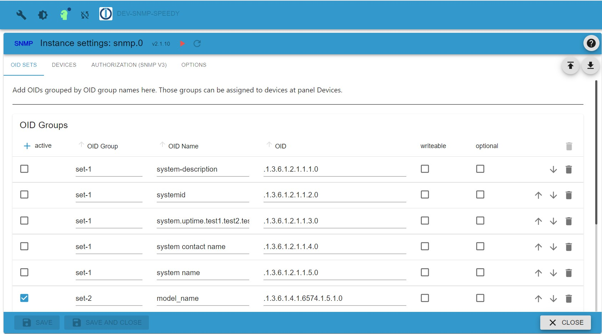
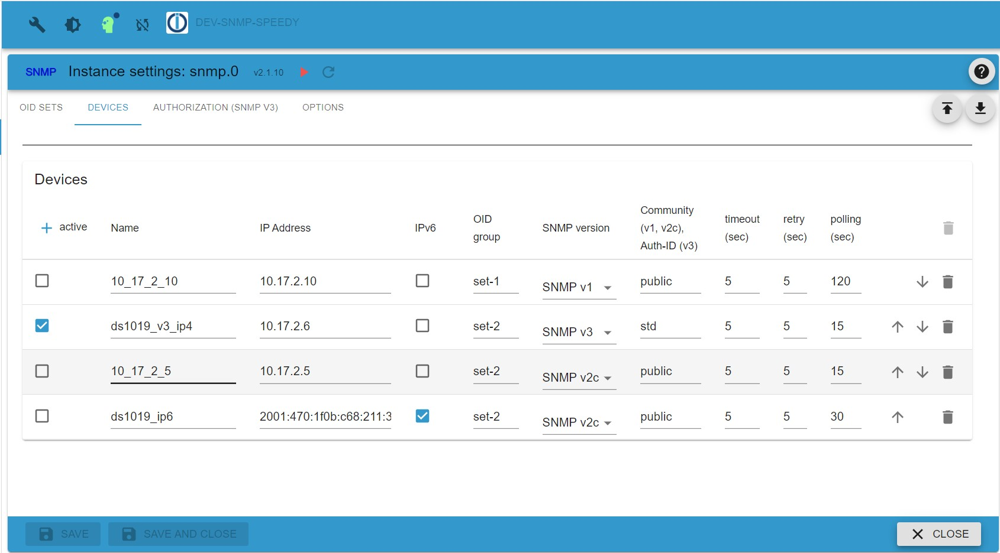
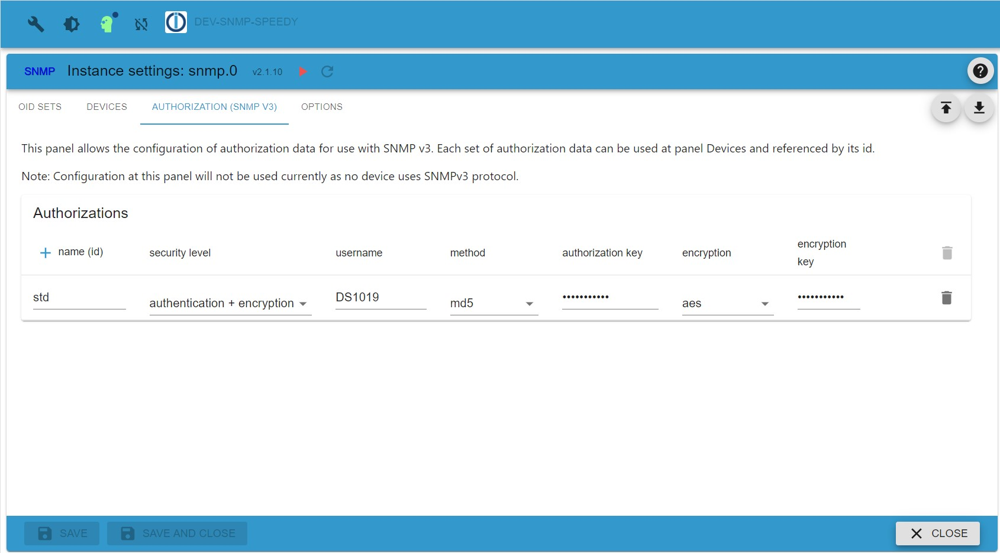
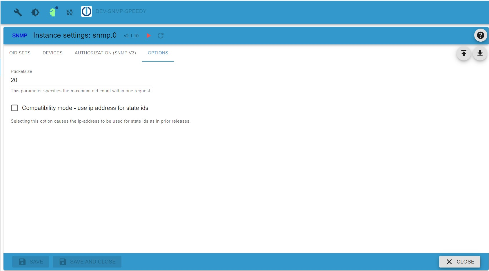

# SNMP adapter information

## General information

Simple Network Management Protocol (SNMP) is an Internet Standard protocol for collecting and organizing information about 
managed devices on IP networks and for modifying that information to change device behaviour. Devices that typically support 
SNMP include cable modems, routers, switches, servers, workstations, printers, and more.

SNMP is widely used in network management for network monitoring. SNMP exposes management data in the form of variables 
on the managed systems organized in a management information base (MIB) which describe the system status and configuration. 
These variables can then be remotely queried (and, in some circumstances, manipulated) by managing applications.

Three significant versions of SNMP have been developed and deployed. SNMPv1 is the original version of the protocol. 
More recent versions, SNMPv2c and SNMPv3, feature improvements in performance, flexibility and security.
(Text taken from Wikipedia, the free encyclopedia)

The SNMP adapter uses the so-called OID's (Object Identifier) ​​to read these values ​​from the configured device.

## Configuration

The adapter queries specified oids (object identifiers) which are grouped within oid groups which in turn are assigned to devices. The 
configuration data is entered at several tabs:

### TAB OID-Groups
Here you specify all oids to be queried by the adapter, one oid per line.

| Parameter     | Type        | Description                       | Comment                             |
|---------------|-------------|-----------------------------------|-------------------------------------|
| active        | boolean     | if set to true, OID will be used  | can be used to disable a single OID |
| OID-Group     | text        | name of the OID group             | will used to assign group to device |
| OID-Name      | text        | name assigned to the OID          | will used to name datapoint         |
| OID           | text        | oid string (1.2.3.4.)             | oid string as specified by device vendor |
| writeable     | boolean     | should be set to true if OID is writeable | reserved for future use     |
| optional      | boolean     | should be set to true if OID is optional  | if set to true, no error will be raised if oid is unknown (Functionality not avaialable with snmp V1) |

You can simply activate/deactivate any oid by setting the active flag. Note that the id of the ioBroker state to store the read data is 
normally constructed by combining the devicename (see tab devices) and the OID-name specified here. You can use dots within the OID-name 
to construct a folder structure.

If some oids are not always available, consider settiung the optional flag to avoid unneccessary errors. Please note, that this 
requires the use of snmp v2c or snpm v3 protocol versions.
 
### TAB Devices
Here you specify which devices should be queried.

| Parameter     | Type        | Description                       | Comment                             |
|---------------|-------------|-----------------------------------|-------------------------------------|
| active        | boolean     | if set to true, the device will be used  | can be used to disable a single device |[2001:abcd::30ff]
| Name          | text        | name of the device                | will be used to create name of data points |
| IP address    | text        | ip address (IPv4 or IPv6) or domainname with optional port number    | IPv4 1.2.3.4 or 1.2.3.4:161, IPv6 2001:abcd::30ff, IPv6 [2001:abcd::30ff] or [2001:abcd::30ff]:161, Domain myhost.domain.org or myhost.domain.org:161 |
| IPv6          | boolean     | if set IPv6 should be used        |                                     |
| OID-Group     | text        | OID group specified at tab IOD Groups | A OID group can be assigned to more than one device |                   |
| SNMP-Version  | select      | SNMP version to use               |    |
| Community (v1, v2c) or Auth-ID (v3) | text | community for SNMP v1 or V2c, authorization group for SNMP v3 | |
| timeout (sec) | number      | processing timeout in seconds     |                                     |
| retry (sec)   | number      | retry intervall in seconds        |                                     |
| polling (sec) | number      | poll intervall in seconds         |                                     |

### TAB Authorization
This tab contains SNMP V3 authorization information. 

| Parameter         | Type        | Description                       | Comment                             |
|-------------------|-------------|-----------------------------------|-------------------------------------|
| Name (id)         | text        | id of authorization data          | must match Auth-Id at tab devices   |
| Security Level    | selection   | desired security method           | see description                     |
| Username          | text        | username to authenticate          |                                     |
| Method            | selection   | password hashing method           | supported methods are md5 or sha    |
| Authorization Key | text        | password for authentication       |                                     |
| Encryption        | selection   | encryption method                 |                                     |
| Encryption Key    | text        | encryption key                    |                                     |

Note that Name(id) must be unique.

When selection snmp V3 protocol an extended authentication is required. At tha devices you specify the name of an authentication block
at column Auth-Id. At this tab you must select the desired security level as following:
* minimum - only a username is required
* authentication - username and password are required
* authentication and encryption - username, password and encryption key are required.

Please note, that the specified security level must be supported by the target device and usernema, password and encryption key must match 
the data entered at the target device. You can use the same authorization blok for multiple devices as long as they use the same data.

### TAB Options
Here you specify some general options

| Parameter     | Type        | Description                       | Comment                             |
|---------------|-------------|-----------------------------------|-------------------------------------|
| Packetsize    | integer     | maximum number of OIDs sent within a single request | reduce this value in case of TOOBIG errors |
| Compatibility mode | boolean | if this option is activated, datapoint names are based on ip address | NOTE: outdated - do not use any longer. This flag will not work with IPv6 addresses. Might be removed in future releases. |

The option packetsize can be used to reduce the number of OIDs queried within one request. Depending on the target device the number of 
IODs queried with one request might be limited. In such a case the device might respond with erroro TOOBIG. In such a case try to 
reduce to value for option packetsize.

## OID Examples

The search for the manufacturer and MIB is successful in most cases. In addition you can use a mib browser software the 
query your target device, i.e. https://www.ireasoning.com/mibbrowser.shtml

### Printers

For most printers, there is a standard. (PRINTER MIB)
http://www.oidview.com/mibs/0/Printer-MIB.html

For the Samsung CLP320 color laser, e.g. the following OIDs are valid.

Number of printed pages: 1.3.6.1.2.1.43.10.2.1.4.1.1

Black toner: 1.3.6.1.2.1.43.11.1.1.9.1.1

Toner cyan: 1.3.6.1.2.1.43.11.1.1.9.1.2

Toner magenta: 1.3.6.1.2.1.43.11.1.1.9.1.3

Toner yellow: 1.3.6.1.2.1.43.11.1.1.9.1.4

Life_drum unit: 1.3.6.1.2.1.43.11.1.1.9.1.7

### NAS Systems - Synology

Synology: By default, SNMP is disabled on Synology Diskstations and must be enabled in the WebUI. It is important that the port 161 by default remains and community is set correctly. Mostly it is public.

https://global.download.synology.com/download/Document/MIBGuide/Synology_DiskStation_MIB_Guide.pdf

