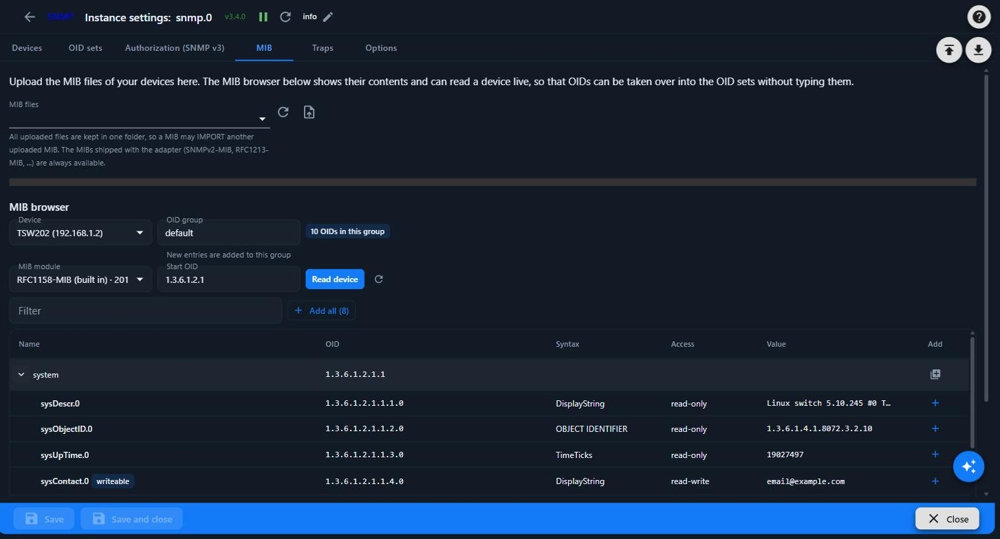
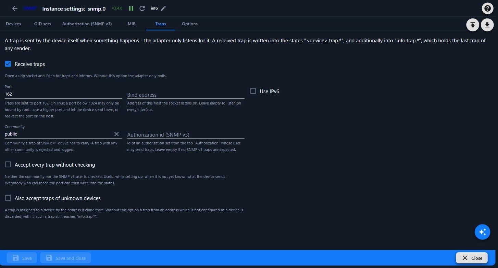

# SNMP adapter information

## General information
Simple Network Management Protocol (SNMP) is an Internet Standard protocol for collecting and organizing information about 
managed devices on IP networks and for modifying that information to change device behaviour. Devices that typically support 
SNMP include cable modems, routers, switches, servers, workstations, printers, and more.

SNMP is widely used in network management for network monitoring. SNMP exposes management data in the form of variables 
on the managed systems organized in a management information base (MIB) which describe the system status and configuration. 
These variables can then be remotely queried (and, in some circumstances, manipulated) by managing applications.

Three significant versions of SNMP have been developed and deployed. SNMPv1 is the original version of the protocol. 
More recent versions, SNMPv2c and SNMPv3, feature improvements in performance, flexibility and security.
(Text taken from Wikipedia, the free encyclopedia)

The SNMP adapter uses the so-called OID's (Object Identifier) to read these values from the configured device.

## Configuration
The adapter queries specified OIDs (object identifiers) which are grouped within oid groups which in turn are assigned to devices. The 
configuration data is entered at several tabs, in the order in which they appear: first the devices, then the OIDs they read. A device
whose OID group does not exist yet can be saved - the adapter warns about it and skips that device until its OIDs have been defined.

### TAB OID-Groups
Here you specify all OIDs to be queried by the adapter, one oid per line.

<p align="center"></p>

| Parameter     | Type       | Description                               | Comment                                                                                               |
|---------------|------------|-------------------------------------------|-------------------------------------------------------------------------------------------------------|
| active        | boolean    | if set to true, OID will be used          | can be used to disable a single OID                                                                   |
| OID-Group     | text       | name of the OID group                     | will used to assign group to device                                                                   |
| OID-Name      | text       | name assigned to the OID                  | will used to name datapoint                                                                           |
| OID           | text       | oid string (1.2.3.4.)                     | oid string as specified by device vendor                                                              |
| Format        | select     | how the value is stored                   | String, Number, Boolean, JSON or Automatic - see *Format and state type* below                        |
| writeable     | boolean    | should be set to true if OID is writeable | the state is created writeable and written back to the device, see *Writing* below                    |
| optional      | boolean    | should be set to true if OID is optional  | if set to true, no error will be raised if oid is unknown (Functionality not avaialable with snmp V1) |


You can simply activate/deactivate any oid by setting the active flag. Note that the ID of the ioBroker state to store the read data is 
normally constructed by combining the device name (see tab devices) and the OID-name specified here. You can use dots within the OID-name 
to construct a folder structure.

If some OIDs are not always available, consider setting the optional flag to avoid unnecessary errors. Please note that this 
requires the use of snmp v2c or SNMPv3 protocol versions.

#### Format and state type

The format decides how the value read is stored, and with it the type of the ioBroker state:

| Format    | state type | value                                                                                         |
|-----------|------------|-----------------------------------------------------------------------------------------------|
| String    | string     | the value as text                                                                             |
| Number    | number     | the numeric value; data that is not numeric sets the quality to 0x01                          |
| Boolean   | boolean    | false for 0 resp. an empty value, true otherwise                                              |
| JSON      | string     | `{"type":"<type>","data":<value>}`, so that scripts get the value together with its type      |
| Hex dump  | string     | the bytes of the value as `76 01 04 00 27 10`, the way a MIB browser shows binary data        |
| Automatic | mixed      | the type follows the SNMP type of the value                                                   |

**Hex dump** is meant for the binary data some devices answer with - maintenance counters of a
printer for example. Such an OctetString reads as `vy'swz'tx{'u` with any of the other formats,
while the hex dump keeps it usable: the pairs are separated by blanks, so `val.split(' ')` in a
script gives the bytes. It works for OctetString, Opaque and Counter64, renders an integer as its
own hexadecimal representation (10000 becomes `27 10`) and is refused for an OID or an IP address,
which carry no bytes of their own. A writeable OID takes a hex dump back, with or without blanks and
with or without a leading `0x`.

With **Automatic** an integer type (Integer32, Counter32, Gauge32, TimeTicks, Counter64, …) becomes
a number, Boolean becomes a boolean and everything else (OctetString, OID, IpAddress, Opaque) a
string. The state is created as `mixed`, because the device decides what arrives. Choose one of the
fixed formats if a script or a chart needs a stable type.
 
#### Templates

Above the table, **Templates** exchanges a whole OID group as a file, so that a set of OIDs which
has been put together once can be used again - on another instance, on a second device of the same
type, or by somebody else in the forum.

*Save as template* writes the OIDs of the selected group into `<group>.snmp-template.json`. The
group itself is not part of the file: it belongs to the installation, not to the device class, and
is chosen again on import.

The import has two sources: *Delivered template* offers the sets which come with the adapter, and
*From file* takes a template somebody sent you. The button next to them adds the OIDs to the
selected group; the switch behind it changes to *mode: replace*, which drops the OIDs the group
already has. Nothing is stored until the save button of the dialog is pressed.

Delivered are `System` (the system group every device answers), `Interface 1` (the counters of the
first port of a switch), `Host` (uptime, memory and processor load of a computer), `Printer` (page
counter, toner and the state of a printer) and `UPS` (battery and remaining runtime). They use the
OIDs of the standard MIBs - a device which only answers the MIB of its manufacturer is equipped with
the MIB browser instead.

A template is plain json and can be written by hand:

```json
{
    "format": "snmp-template",
    "version": 1,
    "name": "Brother HL-L2350DW",
    "deviceClass": "network printer",
    "description": "what the template is good for",
    "mib": "Printer-MIB",
    "oids": [
        {
            "oidName": "pages",
            "oidOid": "1.3.6.1.2.1.43.10.2.1.4.1.1",
            "oidFormat": 1,
            "oidWriteable": false,
            "oidOptional": false
        }
    ]
}
```

`format` and `name` have to be there, `oids` must not be empty and every entry needs `oidName` and
`oidOid`; `deviceClass`, `description` and `mib` are shown on import and are optional. `oidFormat`
is the format of the table as a number - 0 string, 1 number, 2 boolean, 3 json, 4 hex dump,
99 automatic - and an entry without it is read as automatic.

### TAB Devices
Here you specify which devices should be queried.

The button **Set up device** opens a wizard which walks through the three steps a new device needs:
the device itself (name, address, SNMP version, community), its MIB files - which are optional and
can be uploaded right there - and the values it should read. The last step reads the device live,
even though it has not been saved yet, so you can tick the values you actually get. The wizard
writes the device and its OIDs into the tables of this dialog; saving stays with the save button.

The button **Set up device** opens a wizard which walks through the three steps a new device needs:
the device itself (name, address, SNMP version, community), its MIB files - which are optional and
can be uploaded right there - and the values it should read. The last step reads the device live,
even though it has not been saved yet, so you can tick the values you actually get. The wizard
writes the device and its OIDs into the tables of this dialog; saving stays with the save button.

<p align="center"></p>

| Parameter                             | Type    | Description                                                       | Comment                                                                                                                                               |
|---------------------------------------|---------|-------------------------------------------------------------------|-------------------------------------------------------------------------------------------------------------------------------------------------------|
| active                                | boolean | if set to true, the device will be used                           | can be used to disable a single device                                                                                                                |
| Name                                  | text    | name of the device                                                | will be used to create name of data points                                                                                                            |
| IP address                            | text    | ip address (IPv4 or IPv6) or domainname with optional port number | IPv4 1.2.3.4 or 1.2.3.4:161, IPv6 2001:abcd::30ff, IPv6 [2001:abcd::30ff] or [2001:abcd::30ff]:161, Domain myhost.domain.org or myhost.domain.org:161 |
| IPv6                                  | boolean | if set IPv6 should be used                                        |                                                                                                                                                       |
| OID-Group                             | text    | OID group specified at tab IOD Groups                             | A OID group can be assigned to more than one device                                                                                                   |                   |
| SNMP-Version                          | select  | SNMP version to use                                               |                                                                                                                                                       |
| Community (v1, v2c) or Auth-ID (v3)   | text    | community for SNMP v1 or V2c, authorization group for SNMP v3     |                                                                                                                                                       |
| timeout (sec)                         | number  | processing timeout in seconds                                     |                                                                                                                                                       |
| retry (sec)                           | number  | retry intervall in seconds                                        |                                                                                                                                                       |
| polling (sec)                         | number  | poll intervall in seconds                                         |                                                                                                                                                       |


### TAB Authorization
This tab contains SNMP V3 authorization information. 

<p align=center></p>

| Parameter         | Type        | Description                 | Comment                                    |
|-------------------|-------------|-----------------------------|--------------------------------------------|
| Name (id)         | text        | id of authorization data    | must match Auth-Id at tab devices          |
| Security Level    | selection   | desired security method     | see description                            |
| Username          | text        | username to authenticate    |                                            |
| Method            | selection   | password hashing method     | md5, sha, sha224, sha256, sha384 or sha512 |
| Authorization Key | text        | password for authentication |                                            |
| Encryption        | selection   | encryption method           | des, aes, aes256b or aes256r               |
| Encryption Key    | text        | encryption key              |                                            |

Note that Name(id) must be unique. The Auth-Id of a device on the *Devices* tab has to match one
of these names - leading and trailing blanks are ignored on both sides. A device using SNMP v3 whose
Auth-Id matches nothing is skipped with a warning, because the adapter would otherwise ask without a
user name and the device would answer "Unknown User Name", which says nothing about the real cause.

When selection snmp V3 protocol, an extended authentication is required. At the devices you specify the name of an authentication block
at column Auth-Id. At this tab you must select the desired security level as follows:
* minimum - only a username is required
* authentication - username and password are required
* authentication and encryption - username, password and encryption key are required.

Please note that the specified security level must be supported by the target device and username, password and encryption key must match 
the data entered at the target device. You can use the same authorization block for multiple devices as long as they use the same data.

### TAB MIB
Here you upload the MIB files of your devices and browse their contents.

| Parameter | Type | Description                       | Comment                                                                     |
|-----------|------|-----------------------------------|-----------------------------------------------------------------------------|
| MIB files | file | MIB files of your devices         | all uploaded files are kept in one folder, so a MIB may IMPORT another one  |

The MIBs shipped with the adapter (SNMPv2-MIB, RFC1213-MIB, IF-MIB and the other SMI base modules)
are always available and do not have to be uploaded.

<p align="center"></p>

Below the upload the **MIB browser** shows the device itself. At the top you choose the **device**
the OIDs are collected for - its OID group is filled in automatically, so you normally never have to
type a group name.

The tree below is always the device, read live and one level at a time: the start OID gives the
first level, opening a folder reads what is inside it. So only what you actually look at is read,
and what you see are the values that really exist. The uploaded MIB files give those values their
names - `1.3.6.1.4.1.48690.10.2.1.2.1` becomes `pName.1`, with syntax, access rights and the
DESCRIPTION text as a tooltip. An OID no MIB covers keeps its numbers. The **MIB module** list jumps
to the beginning of a MIB, so you do not have to know its OID; the start OID can also be typed.

This requires a running instance, and the device must have been saved once - a device that only
exists in the dialog cannot be read yet. In the setup wizard on the *Devices* tab it can, because
there the whole device is sent along with the request.

A value read from a table row brings its index, so it is taken over as it is. A column itself does
not address a value - it is marked, and opening it shows the rows to pick from. A scalar is taken
over as `<OID>.0`, which is where SNMP keeps its only value, and the `.0` is left out of the
object id again.

The plus button of a row adds that OID to the OID group shown above, **Add all** adds everything the
filter currently shows, and the button of a folder adds every value below that node - the whole
table with one click. An OID the group already contains is marked with a check mark instead of the
plus, so it cannot be added twice. The OID name is taken from the MIB, the format is set to
*automatic* and *writeable* is taken over from the MAX-ACCESS clause of the MIB.

So the usual procedure for a new device is: create the device with its IP address on the *Devices*
tab, upload its MIB here if you have one, then select the device in the MIB browser and pick the
values you want - or enter the OIDs by hand on the *OID groups* tab. Until the OID group of a device
contains at least one active OID, the adapter skips that device with a warning and keeps running, so
that the MIB browser can still read the MIB files and the device itself.

### TAB Traps
A trap is the other direction: the device sends it by itself when something happens - a port goes
down, a UPS switches to battery, a printer runs out of paper - and the adapter only listens for it.
Nothing is polled here, so a trap arrives when it arrives.

<p align=center></p>

| Parameter                            | Type     | Description                                                | Comment                                                                                     |
|--------------------------------------|----------|------------------------------------------------------------|---------------------------------------------------------------------------------------------|
| Receive traps                        | boolean  | open a udp socket and listen for traps and informs          | without it the adapter only polls                                                           |
| Port                                 | number   | udp port to listen on                                       | devices send to 162; on linux a port below 1024 may only be bound by root                   |
| Bind address                         | text     | address of this host to listen on                           | empty listens on every interface                                                            |
| Use IPv6                             | boolean  | listen on IPv6 instead of IPv4                              | an IPv4 sender is still recognized, the mapping `::ffff:` is removed                        |
| Community                            | text     | community a trap of SNMP v1 or v2c has to carry             | a trap with another community is rejected and logged                                        |
| Authorization id (SNMP v3)           | text     | id of an authorization set whose user may send traps        | empty if no SNMP v3 traps are expected                                                      |
| Accept every trap without checking   | boolean  | neither the community nor the SNMP v3 user is checked       | for setting up - everybody who reaches the port can then write into the states              |
| Also accept traps of unknown devices | boolean  | process a trap whose sender is not configured as a device   | such a trap only reaches `info.trap.*`                                                      |

A trap names no device, it just arrives - so the address it came from decides which device it
belongs to. A trap from an address which is not configured as a device is discarded, unless the
last option is set. An SNMP v1 trap additionally reports the address of the agent it is about,
which is used when the sender itself is not a configured device - that is what makes a relay work.

An inform is a trap which wants to be acknowledged; the adapter answers it before it processes it,
so the sender does not repeat it.

Note that the port has to be reachable: 162 is a privileged port on linux, and a container or a
firewall has to let udp through. If the port cannot be bound, the reason is written into the log.

### TAB Options
Here you specify some general options

<p align=center></p>

| Parameter                     | Type    | Description                                                             | Comment                                                                                                                     |
|-------------------------------|---------|-------------------------------------------------------------------------|-----------------------------------------------------------------------------------------------------------------------------|
| Packetsize                    | integer | maximum number of OIDs sent within a single request                     | reduce this value in case of TOOBIG errors                                                                                  |
| Compatibility mode            | boolean | if this option is activated, datapoint names are based on ip address    | NOTE: outdated - do not use any longer. This flag will not work with IPv6 addresses. Might be removed in future releases.   |
| Do not close session on error | boolean | do not close and reopen the reader session of a device on an error      | try this if a device does not answer any more after a single failed request                                                 |
| Use MIB names                 | boolean | OID field accepts symbolic MIB names and the object ids follow the MIB  | see below. NOTE: switching this option changes the object ids of existing OIDs                                              |
| Add raw states                | boolean | create an additional state `<OID-name>-raw` per OID                     | the varbind as json, for everything the formats above do not cover                                                          |
| Add type states               | boolean | create an additional state `<OID-name>-type` per OID                    | the SNMP type the device answered with, e.g. `OctetString`                                                                  |
| Trace all snmp requests and answers | boolean | write every request and every answer into the log as json | for a support case - the log grows with every poll, switch it off afterwards |


The option packet size can be used to reduce the number of OIDs queried within one request. Depending on the target device, the number of 
IODs queried with one request might be limited. In such a case the device might respond with error TOOBIG. In such a case try to 
reduce to value for option packet size.

The option **do not close session on error** keeps the reader session of a device open when a
request fails. Normally the adapter closes the session on an error and opens a new one for the next
attempt, which is the right thing for most devices. Some devices, however, stop answering after such
a reconnect - for those, switch this option on.

The option **trace all snmp requests and answers** writes every request the adapter sends and every
answer it receives into the log as json, marked with `[trace]` and the device it belongs to:

```
[trace] [printer] get request ["1.3.6.1.2.1.43.11.1.1.9.1.1"]
[trace] [printer] get answer {"err":null,"varbinds":[{"oid":"1.3.6.1.2.1.43.11.1.1.9.1.1","type":2,"value":1200}]}
```

It covers the polls of the devices, the write of a writeable OID and the requests of the MIB
browser. Binary data appears as `{"type":"Buffer","data":[…]}`, so nothing is lost on the way into
the log. The lines are written at info level, so the trace can be collected without switching the
whole instance to debug - but it grows with every poll, so switch the option off when the analysis
is done.

The option **use MIB names** changes two things at once. The OID column of the OID sets then also
accepts a symbolic name such as `IF-MIB::ifDescr.1` (or `ifDescr.1` without the module), which the
adapter resolves to the numeric OID at startup using the uploaded MIB files. And the id of the
ioBroker state is no longer built from the OID name but from the MIB symbol, so the example above
ends up in `snmp.0.<device>.ifDescr.1` instead of `snmp.0.<device>.<OID-name>`.

Attention: switching this option changes the ids of the states of all OIDs that a MIB covers. The
objects written before keep their old ids and stay behind as orphans - delete them by hand if they
are no longer wanted. OIDs that no loaded MIB covers keep using their OID name.

## States and objects

For every active device the adapter creates one device object, a folder `info` with the status of
that device, and one state per active OID of the OID group assigned to it:

| id                                | type       | role                  | meaning                                                               |
|-----------------------------------|------------|-----------------------|-----------------------------------------------------------------------|
| `snmp.<instance>.info.connection` | boolean    | indicator.connected   | true while at least one device answers                                |
| `<device>`                        | device     | -                     | `common.statusStates` points to the two states below                  |
| `<device>.info.online`            | boolean    | indicator.reachable   | true while the device answers                                         |
| `<device>.info.error`             | boolean    | indicator.error       | true after an error, false again after the next successful read       |
| `<device>.info.error_text`        | string     | text                  | the message of the last error                                         |
| `<device>.<OID-name>`             | see format | see below             | the value read; dots in the OID name become folders                   |
| `<device>.<OID-name>-type`        | string     | text                  | SNMP type of the value, only with the option *add type states*        |
| `<device>.<OID-name>-raw`         | string     | json                  | the varbind as it arrived, only with the option *add raw states*      |

`<device>` is the name of the device; with the compatibility mode it is the IP address with `_`
instead of `.`. These ids are what scripts and charts refer to, so they do not change - with one
exception, which the option *use MIB names* documents above.

The role of the value state follows its type, so that a visualization knows what it is:

| state type                 | read only    | writeable  |
|----------------------------|--------------|------------|
| number                     | `value`      | `level`    |
| boolean                    | `indicator`  | `switch`   |
| string                     | `text`       | `text`     |
| mixed (format *automatic*) | `state`      | `state`    |

With the trap receiver enabled every device gets four more states, and the same set exists once
below `info` holding the last trap of any sender:

| id                       | type    | role  | meaning                                                                  |
|--------------------------|---------|-------|---------------------------------------------------------------------------|
| `<device>.trap.oid`      | string  | text  | numeric oid of the last trap                                             |
| `<device>.trap.name`     | string  | text  | the symbol a MIB gives it, the numeric oid if no MIB covers it            |
| `<device>.trap.json`     | string  | json  | the whole trap with all its varbinds, see below                          |
| `<device>.trap.count`    | number  | value | traps received from this device since the instance has been started      |
| `info.trap.address`      | string  | text  | address the last trap came from                                          |
| `info.trap.oid` / `.name` / `.json` / `.count` | | | the same for the last trap of any sender                  |

**Subscribe to `count`** to react on a trap: it changes with every single trap, while `oid` and
`name` stay the same when a device repeats itself. The other three states are already written when
`count` changes.

The json holds everything the trap reported:

```json
{
    "oid": "1.3.6.1.6.3.1.1.5.3",
    "name": "IF-MIB::linkDown",
    "version": 1,
    "address": "192.168.1.2",
    "sender": "public",
    "inform": false,
    "upTime": 4,
    "enterprise": "1.3.6.1.4.1",
    "agentAddr": "192.168.1.2",
    "generic": 2,
    "specific": 0,
    "varbinds": [
        { "oid": "1.3.6.1.2.1.2.2.1.1.3", "name": "IF-MIB::ifIndex.3", "type": "Integer32", "value": 3 }
    ]
}
```

`version` is 1, 2 or 3, `sender` is the community resp. the user name the trap was sent with, and
`inform` says whether it had to be acknowledged. `enterprise`, `agentAddr`, `generic` and
`specific` only appear for an SNMP v1 trap - those are the four fields such a trap describes itself
with, and `oid` is what RFC 3584 makes out of them, so a v1 and a v2c trap can be compared. The
varbinds are listed in the order they arrived, including the `sysUpTime.0` and `snmpTrapOID.0` an
SNMP v2c trap starts with; their values are decoded like the format *automatic* does it.

### Quality

Every value carries the ioBroker quality code, so a script can tell a real value from a missing one:

| quality | meaning                                                                               |
|---------|---------------------------------------------------------------------------------------|
| 0x00    | ok                                                                                    |
| 0x01    | the value could not be converted into the configured format                           |
| 0x02    | the device did not answer (timeout), the last value stays                             |
| 0x44    | the device reported an error, the value is set to null                                |
| 0x84    | the OID does not exist on this device (NoSuchInstance), the value is set to null      |

### Writing

An OID marked as *writeable* creates a writeable state which the adapter subscribes to. Setting it
without `ack` writes the value to the device with an SNMP `set`. The value is encoded back into the
SNMP type of the last value read, so such an OID has to have been read once before it can be
written - until then the adapter logs "cannot write to uninitialized state".

## OID Examples
The search for the manufacturer and MIB is successful in most cases. In addition, you can use MIB browser software to 
query your target device, i.e. https://www.ireasoning.com/mibbrowser.shtml

### Printers
For most printers, there is a standard. (PRINTER MIB)
http://www.oidview.com/mibs/0/Printer-MIB.html

For the Samsung CLP320 color laser, e.g. the following OIDs are valid.
- Number of printed pages: 1.3.6.1.2.1.43.10.2.1.4.1.1
- Black toner: 1.3.6.1.2.1.43.11.1.1.9.1.1
- Toner cyan: 1.3.6.1.2.1.43.11.1.1.9.1.2
- Toner magenta: 1.3.6.1.2.1.43.11.1.1.9.1.3
- Toner yellow: 1.3.6.1.2.1.43.11.1.1.9.1.4
- Life_drum unit: 1.3.6.1.2.1.43.11.1.1.9.1.7

### NAS Systems - Synology
Synology: By default, SNMP is disabled on Synology Diskstations and must be enabled in the WebUI. It is important that port 161 by default remains and community is set correctly. Mostly it is public.

https://global.download.synology.com/download/Document/MIBGuide/Synology_DiskStation_MIB_Guide.pdf

### USV 
For APC USVs you could check https://www.opsview.com/resources/monitoring/blog/apc-ups-monitoring-useful-oids


