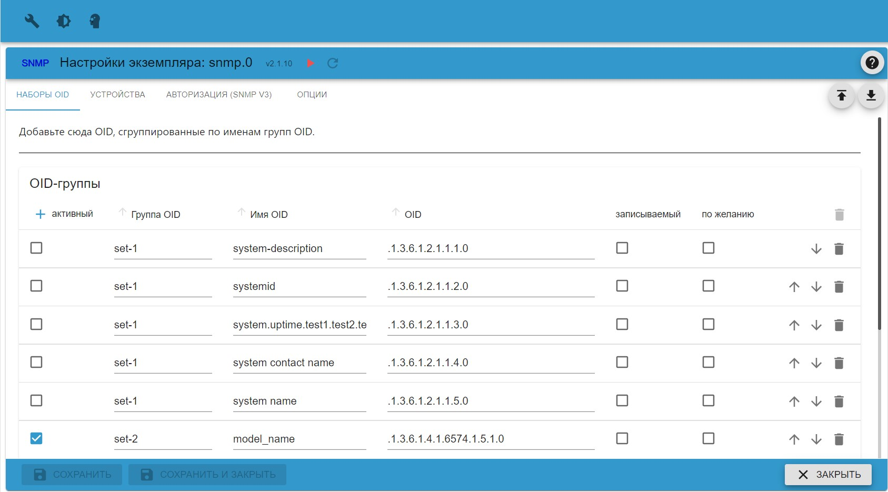
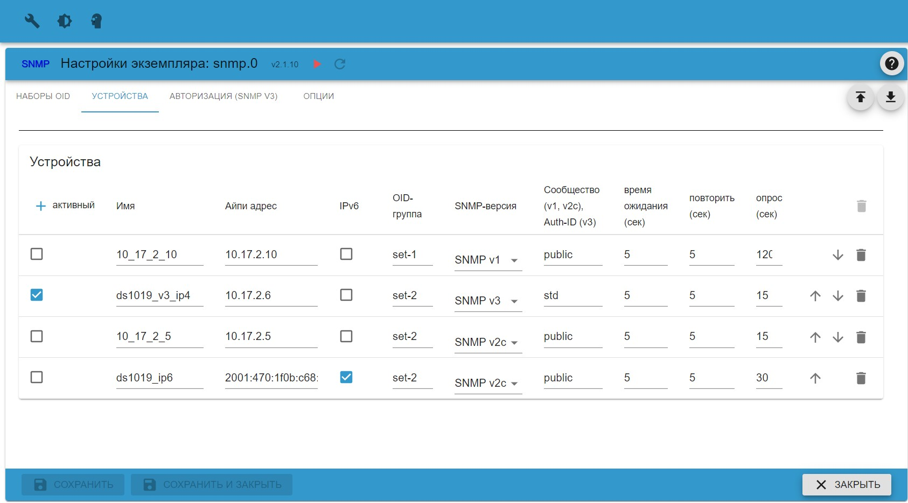
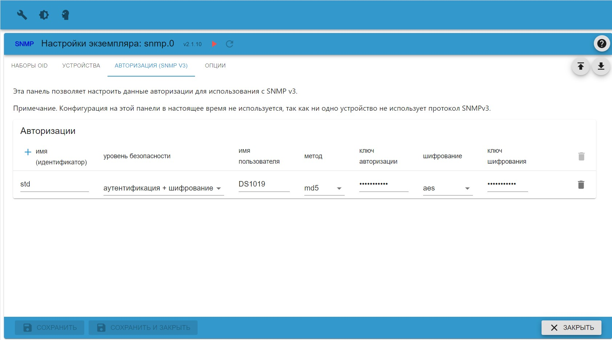
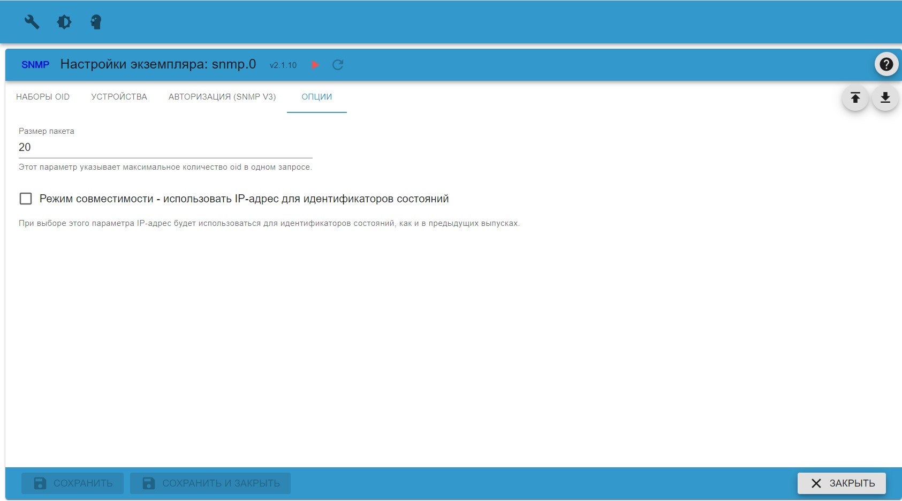

# Информация об адаптере SNMP

## Главная Информация

Простой протокол управления сетью (SNMP) — это стандартный интернет-протокол для сбора и организации информации о
управляемых устройств в IP-сетях и для изменения этой информации для изменения поведения устройства. Устройства, которые обычно поддерживают
SNMP включает в себя кабельные модемы, маршрутизаторы, коммутаторы, серверы, рабочие станции, принтеры и многое другое.

SNMP широко используется в управлении сетью для мониторинга сети. SNMP предоставляет данные управления в виде переменных
на управляемых системах, организованных в базу управляющей информации (MIB), которая описывает состояние и конфигурацию системы.
Затем эти переменные могут быть удаленно запрошены (и, в некоторых случаях, ими можно манипулировать) с помощью управляющих приложений.

Были разработаны и развернуты три основные версии SNMP. SNMPv1 — это исходная версия протокола.
В более поздних версиях, SNMPv2c и SNMPv3, улучшены производительность, гибкость и безопасность.
(Текст взят из Википедии, свободной энциклопедии)

Адаптер SNMP использует так называемые OID (идентификатор объекта) для чтения этих значений с настроенного устройства.

## Конфигурация

Адаптер запрашивает указанные oids (идентификаторы объектов), которые сгруппированы в группы oid, которые, в свою очередь, назначаются устройствам.
данные конфигурации вводятся на нескольких вкладках:

### TAB OID-группы
Здесь вы указываете все oids, которые будут запрашиваться адаптером, по одному oid на строку.

| Параметр | Тип | Описание | Комментарий |
|---------------|-----------------------------------|----------------------------------------------------|
| активный | логический | если установлено значение true, будет использоваться OID | можно использовать для отключения одного OID |
| ОИД-Групп | текст | имя группы OID | будет использоваться для назначения группы устройству |
| OID-имя | текст | имя, присвоенное OID | будет использоваться для обозначения точки данных |
| OID | текст | строка oid (1.2.3.4.) | строка oid, указанная производителем устройства |
| записываемый | логический | должен быть установлен в true, если OID доступен для записи | зарезервировано для использования в будущем |
| необязательный | логический | должно быть установлено значение true, если OID является необязательным | если установлено значение true, ошибка не возникнет, если oid неизвестен (функции недоступны с snmp V1) |

Вы можете просто активировать/деактивировать любой oid, установив активный флаг. Обратите внимание, что идентификатор состояния ioBroker для хранения прочитанных данных:
обычно создается путем объединения имени устройства (см. вкладку «Устройства») и имени OID, указанного здесь. Вы можете использовать точки в имени OID
построить структуру папок.

Если некоторые oids не всегда доступны, рассмотрите возможность установки дополнительного флага, чтобы избежать ненужных ошибок. Обратите внимание, что это
требует использования версий протокола snmp v2c или snpm v3.
 
### TAB-устройства
Здесь вы указываете, какие устройства должны запрашиваться.

| Параметр | Тип | Описание | Комментарий |
|---------------|-----------------------------------|----------------------------------------------------|
| активный | логический | если установлено значение true, устройство будет использоваться | можно использовать для отключения одного устройства |[2001:abcd::30ff]
| Имя | текст | имя устройства | будет использоваться для создания имен точек данных |
| IP-адрес | текст | IP-адрес (IPv4 или IPv6) или доменное имя с необязательным номером порта | IPv4 1.2.3.4 или 1.2.3.4:161, IPv6 2001:abcd::30ff, IPv6 [2001:abcd::30ff] или [2001:abcd::30ff]:161, домен myhost.domain.org или myhost.domain .org:161 |
| IPv6 | логический | если установлен IPv6, следует использовать | |
| ОИД-Групп | текст | Группа OID, указанная на вкладке IOD Groups | Группа OID может быть назначена более чем одному устройству | |
| SNMP-версия | выбрать | используемая версия SNMP | |
| Сообщество (v1, v2c) или Auth-ID (v3) | текст | сообщество для SNMP v1 или V2c, группа авторизации для SNMP v3 | |
| время ожидания (сек) | номер | время ожидания обработки в секундах | |
| повтор (сек) | номер | интервал повтора в секундах | |
| опрос (сек) | номер | интервал опроса в секундах | |

### TAB Авторизация
Эта вкладка содержит информацию об авторизации SNMP V3.

| Параметр | Тип | Описание | Комментарий |
|------------------|--------------|----------------------|-----------------------|
| Имя (идентификатор) | текст | id авторизационных данных | должен совпадать с Auth-Id на вкладке устройств |
| Уровень безопасности | выбор | желаемый метод безопасности | см. описание |
| Имя пользователя | текст | имя пользователя для аутентификации | |
| Метод | выбор | метод хеширования пароля | поддерживаемые методы: md5 или sha |
| Ключ авторизации | текст | пароль для аутентификации | |
| Шифрование | выбор | метод шифрования | |
| Ключ шифрования | текст | ключ шифрования | |

Обратите внимание, что Name(id) должен быть уникальным.

При выборе протокола snmp V3 требуется расширенная аутентификация. На этих устройствах вы указываете имя блока аутентификации
в столбце Auth-Id. На этой вкладке вы должны выбрать желаемый уровень безопасности следующим образом:
* минимум - требуется только имя пользователя
* аутентификация - требуется имя пользователя и пароль
* аутентификация и шифрование - требуются имя пользователя, пароль и ключ шифрования.

Обратите внимание, что указанный уровень безопасности должен поддерживаться целевым устройством, а имя пользователя, пароль и ключ шифрования должны совпадать.
данные, введенные на целевом устройстве. Вы можете использовать один и тот же блок авторизации для нескольких устройств, если они используют одни и те же данные.

### Параметры табуляции
Здесь вы указываете некоторые общие параметры

| Параметр | Тип | Описание | Комментарий |
|---------------|-----------------------------------|----------------------------------------------------|
| Размер пакета | целое число | максимальное количество OID, отправляемых в одном запросе | уменьшить это значение в случае СЛИШКОМ БОЛЬШИХ ошибок |
| Режим совместимости | логический | если эта опция активирована, имена точек данных основаны на IP-адресе | ПРИМЕЧАНИЕ: устарело - больше не используйте. Этот флаг не будет работать с адресами IPv6. Может быть удалено в будущих версиях. |

Параметр packetsize можно использовать для уменьшения количества OID, запрашиваемых в одном запросе. В зависимости от целевого устройства количество
IOD, запрошенные одним запросом, могут быть ограничены. В таком случае устройство может ответить erroro TOOBIG. В таком случае постарайтесь
уменьшите до значения для размера пакета опции.

## Примеры OID

Поиск производителя и MIB в большинстве случаев оказывается успешным. Кроме того, вы можете использовать программное обеспечение mib-браузера
запросите целевое устройство, например https://www.ireasoning.com/mibbbrowser.shtml

### Принтеры

Для большинства принтеров существует стандарт. (МБ ПРИНТЕРА)
http://www.oidview.com/mibs/0/Printer-MIB.html

Для цветного лазера Samsung CLP320, например. допустимы следующие OID.

Количество распечатанных страниц: 1.3.6.1.2.1.43.10.2.1.4.1.1

Черный тонер: 1.3.6.1.2.1.43.11.1.1.9.1.1

Голубой тонер: 1.3.6.1.2.1.43.11.1.1.9.1.2

Пурпурный тонер: 1.3.6.1.2.1.43.11.1.1.9.1.3

Желтый тонер: 1.3.6.1.2.1.43.11.1.1.9.1.4

Блок Life_drum: 1.3.6.1.2.1.43.11.1.1.9.1.7

### Системы NAS — Synology

Synology: по умолчанию SNMP отключен на Synology Diskstation и должен быть включен в веб-интерфейсе. Важно, чтобы порт 161 по умолчанию оставался и сообщество было установлено правильно. В основном он публичный.

https://global.download.synology.com/download/Document/MIBGuide/Synology_DiskStation_MIB_Guide.pdf