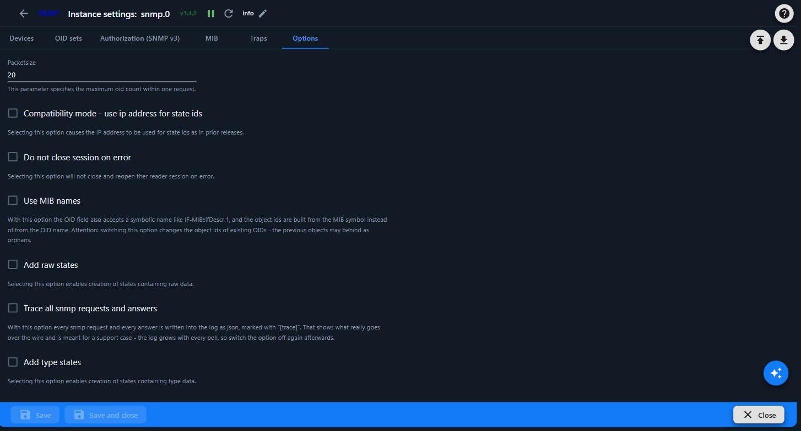

# Информация об адаптере SNMP

## Главная Информация
Простой `Simple Network Management Protocol` (SNMP) — это стандартный интернет-протокол для сбора и организации информации об
управляемых устройствах в IP-сетях и для изменения этой информации для изменения поведения устройства.
Устройства, которые обычно поддерживают SNMP, включают в себя кабельные модемы, маршрутизаторы, коммутаторы, серверы, рабочие станции, принтеры и многое другое.

SNMP широко используется в управлении сетью для мониторинга сети. SNMP предоставляет данные управления в виде переменных
на управляемых системах, организованных в базу управляющей информации (`Management Information Base`, MIB), которая описывает состояние и конфигурацию системы.
Затем эти переменные могут быть удаленно запрошены (и, в некоторых случаях, ими можно манипулировать) с помощью управляющих приложений.

Были разработаны и развернуты три основные версии SNMP. SNMPv1 — это исходная версия протокола.
В более поздних версиях, SNMPv2c и SNMPv3, улучшены производительность, гибкость и безопасность.
(Текст взят из Википедии, свободной энциклопедии)

Адаптер SNMP использует так называемые OID (идентификатор объекта) для чтения этих значений с настроенного устройства.

## Конфигурация
Адаптер запрашивает указанные OIDs (идентификаторы объектов), которые сгруппированы в группы oid, которые, в свою очередь,
назначаются устройствам. Данные конфигурации вводятся на нескольких вкладках, в том порядке, в котором они показаны:
сначала устройства, затем OID, которые они читают. Устройство, группы OID которого ещё нет, можно сохранить - адаптер
предупредит об этом и пропустит это устройство, пока его OID не будут заданы.

### TAB OID-группы
Здесь вы указываете все OIDs, которые будут запрашиваться адаптером, по одному oid на строку.

| Параметр | Тип | Описание | Комментарий |
|---------------|-----------------------------------|----------------------------------------------------|
| активный | логический | если установлено значение true, будет использоваться OID | можно использовать для отключения одного OID |
| ОИД-Групп | текст | имя группы OID | будет использоваться для назначения группы устройству |
| OID-имя | текст | имя, присвоенное OID | будет использоваться для обозначения точки данных |
| OID | текст | строка oid (1.2.3.4.) | строка oid, указанная производителем устройства |
| Формат | выбор | как сохраняется прочитанное значение | Текст, Число, Логическое, JSON или Автоматически - см. *Формат и тип состояния* ниже |
| записываемый | логический | должен быть установлен в true, если OID доступен для записи | состояние создаётся записываемым и записывается обратно на устройство, см. *Запись* ниже |
| необязательный | логический | должно быть установлено значение true, если OID является необязательным | если установлено значение true, ошибка не возникнет, если oid неизвестен (функции недоступны с snmp V1) |

Вы можете просто активировать/деактивировать любой oid, установив активный флаг. Обратите внимание, что идентификатор состояния ioBroker для хранения прочитанных данных:
обычно создается путем объединения имени устройства (см. вкладку «Устройства») и имени OID, указанного здесь. Вы можете использовать точки в имени OID
построить структуру папок.

Если некоторые OIDs не всегда доступны, рассмотрите возможность установки дополнительного флага, чтобы избежать ненужных ошибок. Обратите внимание, что это
требует использования версий протокола snmp v2c или SNMPv3.

#### Формат и тип состояния

Формат определяет, как сохраняется прочитанное значение, а вместе с этим и тип состояния ioBroker:

| Формат         | Тип состояния | Значение                                                                  |
|----------------|---------------|----------------------------------------------------------------------------|
| Текст          | string        | значение как текст                                                          |
| Число          | number        | числовое значение; нечисловые данные устанавливают качество 0x01            |
| Логическое     | boolean       | false при 0 или пустом значении, иначе true                                 |
| JSON           | string        | `{"type":"<тип>","data":<значение>}` - значение вместе с его типом          |
| Hex-дамп       | string        | байты значения в виде `76 01 04 00 27 10`, как их показывает MIB-браузер     |
| Автоматически  | mixed         | тип следует за SNMP-типом значения                                          |

**Hex-дамп** предназначен для двоичных данных, которые выдают некоторые устройства - например,
счётчики обслуживания принтера. С любым другим форматом такой OctetString читается как
`vy'swz'tx{'u`, а в виде hex-дампа остаётся пригодным: пары разделены пробелами, поэтому
`val.split(' ')` в скрипте даёт байты. Формат работает для OctetString, Opaque и Counter64,
показывает целое число в шестнадцатеричном виде (10000 становится `27 10`) и отклоняется для OID и
IP-адреса, у которых нет собственных байтов. Записываемая OID принимает hex-дамп и обратно - с
пробелами или без, с ведущим `0x` или без него.

При **Автоматически** целочисленные типы (Integer32, Counter32, Gauge32, TimeTicks, Counter64, …)
становятся числом, Boolean - логическим значением, всё остальное (OctetString, OID, IpAddress,
Opaque) - текстом. Состояние создаётся как `mixed`, потому что тип определяет устройство. Если
скрипту или графику нужен постоянный тип, выберите один из фиксированных форматов.
 
### TAB-устройства
Здесь вы указываете, какие устройства должны запрашиваться.

Кнопка **Настроить устройство** открывает мастер из трёх шагов: само устройство (имя, адрес, версия
SNMP, community), его MIB-файлы - они необязательны и загружаются прямо там - и значения, которые
нужно читать. На последнем шаге устройство читается вживую, даже если оно ещё не сохранено, так что
отметить можно именно те значения, которые действительно приходят. Мастер вносит устройство и его
OID в таблицы этого диалога; сохранение остаётся за кнопкой «Сохранить».

| Параметр                              | Тип          | Описание                                                                 | Комментарий                                                                                                                                              |
|---------------------------------------|--------------|--------------------------------------------------------------------------|----------------------------------------------------------------------------------------------------------------------------------------------------------|
| активный                              | логический   | если установлено значение true, устройство будет использоваться          | можно использовать для отключения одного устройства                                                                                                      |
| Имя                                   | текст        | имя устройства                                                           | будет использоваться для создания имен точек данных                                                                                                      |
| IP-адрес                              | текст        | IP-адрес (IPv4 или IPv6) или доменное имя с необязательным номером порта | IPv4 1.2.3.4 или 1.2.3.4:161, IPv6 2001:abcd::30ff, IPv6 [2001:abcd::30ff] или [2001:abcd::30ff]:161, домен myhost.domain.org или myhost.domain .org:161 |
| IPv6                                  | логический   | если установлен IPv6, следует использовать                               |                                                                                                                                                          |
| ОИД-Групп                             | текст        | Группа OID, указанная на вкладке IOD Groups                              | Группа OID может быть назначена более чем одному устройству                                                                                              |
| SNMP-версия                           | выбрать      | используемая версия SNMP                                                 |                                                                                                                                                          |
| Сообщество (v1, v2c) или Auth-ID (v3) | текст        | сообщество для SNMP v1 или V2c, группа авторизации для SNMP v3           |                                                                                                                                                          |
| время ожидания (сек)                  | номер        | время ожидания обработки в секундах                                      |                                                                                                                                                          |
| повтор (сек)                          | номер        | интервал повтора в секундах                                              |                                                                                                                                                          |
| опрос (сек)                           | номер        | интервал опроса в секундах                                               |                                                                                                                                                          |

### TAB Авторизация
Эта вкладка содержит информацию об авторизации SNMP V3.

| Параметр             | Тип   | Описание                            | Комментарий                                     |
|----------------------|-------|-------------------------------------|-------------------------------------------------|
| Имя (идентификатор)  | текст | id авторизационных данных           | должен совпадать с Auth-Id на вкладке устройств |
| Уровень безопасности | выбор | желаемый метод безопасности         | см. описание                                    |
| Имя пользователя     | текст | имя пользователя для аутентификации |                                                 |
| Метод                | выбор | метод хеширования пароля            | md5, sha, sha224, sha256, sha384 или sha512     |
| Ключ авторизации     | текст | пароль для аутентификации           |                                                 |
| Шифрование           | выбор | метод шифрования                    | des, aes, aes256b или aes256r                   |
| Ключ шифрования      | текст | ключ шифрования                     |                                                 |

Обратите внимание, что Name(id) должен быть уникальным.

При выборе протокола snmp V3 требуется расширенная аутентификация. На этих устройствах вы указываете имя блока аутентификации
в столбце Auth-Id. На этой вкладке вы должны выбрать желаемый уровень безопасности следующим образом:
* минимум - требуется только имя пользователя
* аутентификация - требуется имя пользователя и пароль
* аутентификация и шифрование - требуются имя пользователя, пароль и ключ шифрования.

Обратите внимание, что указанный уровень безопасности должен поддерживаться целевым устройством, а имя пользователя,
пароль и ключ шифрования должны совпадать с данными, введенными на целевом устройстве. Вы можете использовать один и тот же блок авторизации для нескольких устройств, если они используют одни и те же данные.

### TAB MIB
Здесь вы загружаете MIB-файлы своих устройств и просматриваете само устройство.

| Параметр    | Тип  | Описание                  | Комментарий                                                                        |
|-------------|------|---------------------------|-------------------------------------------------------------------------------------|
| MIB-файлы   | файл | MIB-файлы ваших устройств | все загруженные файлы лежат в одной папке, поэтому одна MIB может импортировать другую |

MIB, поставляемые вместе с адаптером (SNMPv2-MIB, RFC1213-MIB, IF-MIB и остальные базовые модули
SMI), доступны всегда и загружать их не нужно.

Под загрузкой находится **MIB-браузер**. Сверху выбирается **устройство**, для которого собираются
OID - его группа OID подставляется автоматически, так что имя группы обычно набирать не приходится.

Дерево ниже - это всегда само устройство, читаемое вживую и по одному уровню за раз: начальная OID
даёт первый уровень, при открытии папки читается её содержимое. То есть читается только то, на что
вы смотрите, и видны те значения, которые действительно существуют. Загруженные MIB-файлы дают этим
значениям имена - из `1.3.6.1.4.1.48690.10.2.1.2.1` получается `pName.1`, с синтаксисом, правами
доступа и текстом DESCRIPTION в подсказке. OID, которой нет ни в одной MIB, остаётся числовой.
Список **MIB-модуль** переходит к началу выбранной MIB, начальную OID можно и ввести вручную.

Для этого нужен запущенный экземпляр, а устройство должно быть один раз сохранено - устройство,
существующее только в диалоге, прочитать ещё нельзя. В мастере на вкладке *Устройства* это всё же
работает, потому что там устройство передаётся вместе с запросом.

Значение из строки таблицы приносит свой индекс и переносится как есть. Сам столбец значения не
адресует - он помечен, и при его раскрытии появляются строки на выбор. Скалярное значение
переносится как `<OID>.0` - именно там SNMP хранит своё единственное значение - а `.0` из
идентификатора объекта снова убирается.

Кнопка «плюс» в строке переносит эту OID в показанную выше группу OID, **Перенести все** - всё, что
сейчас показывает фильтр. У папки своя кнопка: она переносит все значения под этим узлом. OID,
которая уже есть в группе, отмечается галочкой вместо плюса и не добавляется второй раз. Имя OID
берётся из MIB, формат устанавливается в *Автоматически*, а признак *записываемый* - из предложения
MAX-ACCESS в MIB.

### Параметры табуляции
Здесь вы указываете некоторые общие параметры

| Параметр             | Тип                                | Описание                                                              | Комментарий                                                                                                                      |
|----------------------|------------------------------------|-----------------------------------------------------------------------|----------------------------------------------------------------------------------------------------------------------------------|
| Размер пакета        | целое число                        | максимальное количество OID, отправляемых в одном запросе             | уменьшить это значение в случае СЛИШКОМ БОЛЬШИХ ошибок                                                                           |
| Режим совместимости  | логический                         | если эта опция активирована, имена точек данных основаны на IP-адресе | ПРИМЕЧАНИЕ: устарело - больше не используйте. Этот флаг не будет работать с адресами IPv6. Может быть удалено в будущих версиях. |
| Не закрывать сессию  | логический                         | не закрывать и не открывать заново сессию чтения устройства при ошибке | стоит попробовать, если устройство перестаёт отвечать после одного неудачного запроса |
| Использовать имена MIB | логический                       | поле OID принимает символические имена MIB, идентификаторы объектов следуют MIB | ВНИМАНИЕ: переключение меняет идентификаторы объектов существующих OID |
| Raw-состояния        | логический                         | создавать для каждой OID дополнительное состояние `<имя OID>-raw`     | varbind в виде json, для всего, что не покрывают форматы выше |
| Состояния типа       | логический                         | создавать для каждой OID дополнительное состояние `<имя OID>-type`    | SNMP-тип, которым ответило устройство, например `OctetString` |

Параметр packetsize можно использовать для уменьшения количества OID, запрашиваемых в одном запросе. В зависимости от целевого устройства количество
IOD, запрошенные одним запросом, могут быть ограничены. В таком случае устройство может ответить erroro TOOBIG. В таком случае постарайтесь
уменьшить до значения для размера пакета опции.

## Состояния и объекты

Для каждого активного устройства адаптер создаёт объект устройства, папку `info` с его состоянием и
по одному состоянию на каждую активную OID назначенной ему группы:

| ID                                 | Тип     | Роль                | Значение                                                        |
|------------------------------------|---------|---------------------|------------------------------------------------------------------|
| `snmp.<экземпляр>.info.connection` | boolean | indicator.connected | true, пока отвечает хотя бы одно устройство                      |
| `<устройство>`                     | device  | -                   | `common.statusStates` указывает на два состояния ниже            |
| `<устройство>.info.online`         | boolean | indicator.reachable | true, пока устройство отвечает                                   |
| `<устройство>.info.error`          | boolean | indicator.error     | true после ошибки, после следующего удачного чтения снова false  |
| `<устройство>.info.error_text`     | string  | text                | текст последней ошибки                                           |
| `<устройство>.<имя OID>`           | см. формат | см. ниже         | прочитанное значение; точки в имени OID превращаются в папки     |
| `<устройство>.<имя OID>-type`      | string  | text                | SNMP-тип значения, только с опцией *Состояния типа*              |
| `<устройство>.<имя OID>-raw`       | string  | json                | varbind в том виде, в котором он пришёл, только с опцией *Raw-состояния* |

`<устройство>` - это имя устройства; в режиме совместимости это IP-адрес с `_` вместо `.`. На эти
идентификаторы ссылаются скрипты и графики, поэтому они не меняются - за одним исключением, которое
описано у опции *Использовать имена MIB*.

Роль состояния значения зависит от его типа, чтобы визуализация знала, с чем имеет дело:

| Тип состояния | только чтение | запись     |
|---------------|---------------|------------|
| number        | `value`       | `level`    |
| boolean       | `indicator`   | `switch`   |
| string        | `text`        | `text`     |
| mixed (формат *Автоматически*) | `state` | `state` |

### Качество

Каждое значение несёт код качества ioBroker, так что скрипт может отличить настоящее значение от
отсутствующего:

| Качество | Значение                                                                        |
|----------|----------------------------------------------------------------------------------|
| 0x00     | в порядке                                                                         |
| 0x01     | значение не удалось преобразовать в выбранный формат                             |
| 0x02     | устройство не ответило (таймаут), прежнее значение остаётся                      |
| 0x44     | устройство сообщило об ошибке, значение устанавливается в null                    |
| 0x84     | этой OID на устройстве нет (NoSuchInstance), значение устанавливается в null      |

### Запись

OID, помеченная как *записываемая*, создаёт записываемое состояние, на которое адаптер
подписывается. Если его установить без `ack`, адаптер запишет значение на устройство командой SNMP
`set`. Значение преобразуется обратно в SNMP-тип последнего прочитанного значения, поэтому такую
OID нужно один раз прочитать, прежде чем в неё можно писать - до этого адаптер сообщает
"cannot write to uninitialized state".

## Примеры OID
Поиск производителя и MIB в большинстве случаев оказывается успешным. Кроме того, вы можете использовать программное обеспечение MIB-браузера для поиска OID, например https://www.ireasoning.com/mibbbrowser.shtml

### Принтеры
Для большинства принтеров существует стандарт. (МБ ПРИНТЕРА)
http://www.oidview.com/mibs/0/Printer-MIB.html

Для цветного лазера Samsung CLP320, например, допустимы следующие OID:
- Количество распечатанных страниц: 1.3.6.1.2.1.43.10.2.1.4.1.1
- Черный тонер: 1.3.6.1.2.1.43.11.1.1.9.1.1
- Голубой тонер: 1.3.6.1.2.1.43.11.1.1.9.1.2
- Пурпурный тонер: 1.3.6.1.2.1.43.11.1.1.9.1.3
- Желтый тонер: 1.3.6.1.2.1.43.11.1.1.9.1.4
- Блок Life_drum: 1.3.6.1.2.1.43.11.1.1.9.1.7

### Системы NAS — Synology
Synology: по умолчанию SNMP отключен на Synology Diskstation и должен быть включен в веб-интерфейсе. Важно, чтобы порт 161 по умолчанию оставался и сообщество было установлено правильно. В основном он публичный.

https://global.download.synology.com/download/Document/MIBGuide/Synology_DiskStation_MIB_Guide.pdf